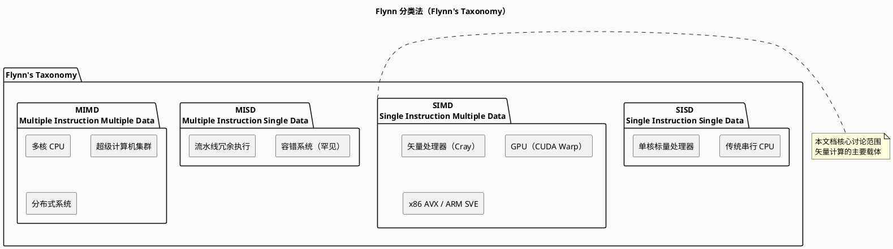
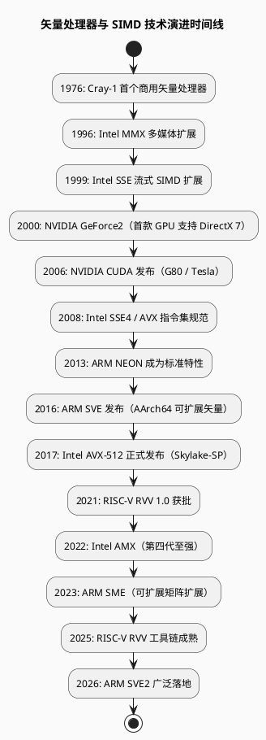
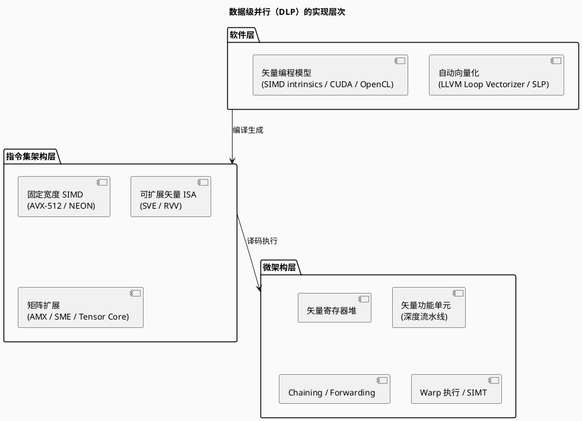
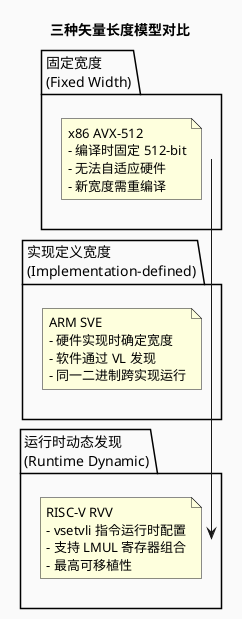

# 矢量计算理论基础

> 计算机体系架构中的矢量计算理论与历史演进

---

## 目录

1. [概述](#概述)
2. [Flynn 分类法](#flynn-分类法)
3. [矢量处理器发展史](#矢量处理器发展史)
4. [矢量计算核心概念](#矢量计算核心概念)
5. [矢量长度模型](#矢量长度模型)
6. [参考文献](#参考文献)

---

## 概述

矢量计算（Vector Computing）是计算机体系架构中实现数据级并行（Data-Level Parallelism, DLP）的核心技术路线。其本质是用单条指令同时操作多个数据元素，从而成倍提升吞吐量。

矢量计算的技术演进经历了以下阶段：

```
1970s: 专用矢量超算（Cray-1）→
1990s: 多媒体扩展（MMX/SSE）→
2000s: GPU 统一着色器 + SIMT →
2010s: 可扩展矢量 ISA（SVE / RVV / AMX）→
2020s: AI 加速矩阵引擎（TPU / NPU）
```

---

## Flynn 分类法

由 **Michael J. Flynn**（Stanford 教授，IEEE/ACM Fellow）于 1966 年提出，是计算机体系架构最根本的分类框架。

### 分类维度

Flynn 分类法以两个维度对计算机架构进行分类：

| 维度 | 含义 |
|------|------|
| **指令流（Instruction Stream）** | 同时有多少条指令在执行 |
| **数据流（Data Stream）** | 同时被处理的数据有多少个 |

### 四类架构



### 详细对比

| 分类 | 全称 | 指令流数 | 数据流数 | 典型硬件 | 适用场景 |
|------|------|---------|---------|---------|---------|
| **SISD** | Single Instruction, Single Data | 1 | 1 | 传统单核 CPU | 通用串行任务 |
| **SIMD** | Single Instruction, Multiple Data | 1 | N | 矢量处理器、GPU、SIMD 扩展指令集 | 数据并行计算、多媒体、AI |
| **MISD** | Multiple Instruction, Single Data | N | 1 | 容错计算机系统（罕见） | 高可靠性场景 |
| **MIMD** | Multiple Instruction, Multiple Data | N | N | 多核 CPU、集群、超算 | 任务并行、分布式计算 |

> **注意**：现代单核 CPU 通过 SSE/AVX 等 SIMD 扩展，实际属于 **SISD + SIMD 混合架构**。现代 GPU 在硬件层是 SIMD，在编程模型层抽象为 SIMT（Single Instruction Multiple Threads）。

---

## 矢量处理器发展史



### 关键里程碑

#### 第一阶段：专用矢量超算（1970s - 1980s）

| 年份 | 事件 | 意义 |
|------|------|------|
| 1976 | **Cray-1** 发布 | 全球首款商用矢量超级计算机，8 个 64 位向量寄存器（各 64 元素），峰值 160 MFLOPS |
| 1980s | **CDC Cyber 205**、**Fujitsu VP** 系列 | 矢量处理成为超算主流架构 |

**核心设计思想**：
- 矢量寄存器堆（Vector Register File）
- 深度流水线矢量功能单元
- 矢量长度寄存器（VL）控制执行长度
- 链式运算（Chaining）：前一条矢量指令的结果可直接作为下一条的输入，无需写回寄存器

#### 第二阶段：多媒体 SIMD 扩展（1990s - 2000s）

| 指令集 | 发布年 | 位宽 | 核心贡献 |
|--------|--------|------|---------|
| **MMX** | 1996 | 64-bit | 首个 x86 SIMD 扩展，8 个 64-bit MM 寄存器 |
| **SSE** | 1999 | 128-bit | 8 个独立 XMM 寄存器，支持单精度浮点 |
| **SSE2** | 2001 | 128-bit | 新增双精度浮点、整数，基本取代 MMX |
| **SSE3/SSSE3/SSE4** | 2004-2007 | 128-bit | 增加水平运算、整数 SIMD 等 |
| **AVX** | 2011 | 256-bit | 16 个 YMM 寄存器（256-bit），三操作数指令（VEX 编码）|
| **AVX2** | 2013 | 256-bit | 完全整数 SIMD 支持，FMA3 |
| **AVX-512** | 2017 | 512-bit | 32 个 ZMM 寄存器，8 个掩码寄存器，EVE 编码 |

#### 第三阶段：GPU 通用计算与 SIMT（2000s - 2010s）

- **2006**：NVIDIA 发布 CUDA，G80 架构引入统一着色器
- **SIMT 模型**：单指令多线程，以 Warp（32 线程）为执行单元
- **GPGPU 革命**：将 GPU 从图形专用设备转变为通用数据并行计算平台

#### 第四阶段：可扩展矢量 ISA（2010s - 2020s）

核心思想：**与向量长度解耦**，同一份二进制适配不同宽度的矢量硬件。

| ISA | 可扩展机制 | 向量宽度范围 |
|-----|-----------|-------------|
| **ARM SVE**（2016） | 实现定义，编程时通过 `VL` 动态发现 | 128 ~ 2048 bit |
| **ARM SVE2**（2019） | 基于 SVE 扩展 DSP/整数能力 | 同 SVE |
| **RISC-V RVV 1.0**（2021） | `vsetvli` 指令运行时配置 VL | 运行时动态发现 |
| **ARM SME**（2023） | 在 SVE 基础上增加矩阵瓦片（Tile） | 与 SVE VL 联动 |

#### 第五阶段：AI 矩阵加速（2020s - 至今）

| 技术 | 厂商 | 核心思想 |
|------|------|---------|
| **Intel AMX** | Intel | CPU 片上矩阵乘法引擎（TMUL），加速 INT8/BF16 |
| **ARM SME** | ARM | 外积矩阵乘法，流式模式 |
| **Google TPU** | Google |  systolic array（脉动阵列），专门优化矩阵乘法 |
| **NVIDIA Tensor Core** | NVIDIA | GPU 内嵌矩阵计算单元，支持 FP16/INT8/BF16/FP8 |

---

## 矢量计算核心概念

### 数据级并行（DLP）的实现方式



### 核心概念术语表

| 术语 | 英文 | 解释 |
|------|------|------|
| **向量长度** | Vector Length (VL) | 单个向量寄存器容纳的数据元素个数 |
| **向量寄存器** | Vector Register | 存放向量数据的寄存器，宽度 = VL × element_width |
| **元素** | Element | 向量中的单个数据单元（如 float32 = 32 bit） |
| **谓词/掩码** | Predicate / Mask | 控制向量中哪些元素参与运算（避免分支发散） |
| **Gather/Scatter** | — | 非连续内存访问的矢量加载/存储 |
| **Chaining** | — | 向量指令间结果直通，无需写回寄存器 |
| **Strip Mining** | — | 将长向量循环拆解为适合硬件向量长度的子循环 |
| **LMUL** | Length Multiplier (RVV) | 将多个向量寄存器组合为更宽逻辑向量 |

---

## 矢量长度模型

矢量长度的处理方式，是区分不同矢量 ISA 架构设计理念的核心维度。



### 详细对比

| 维度 | 固定宽度（AVX-512） | 实现定义（ARM SVE） | 运行时动态（RISC-V RVV） |
|------|-------------------|---------------------|-------------------------|
| **向量宽度** | 编译时硬编码 | 硬件实现时定义 | 运行时通过 `vsetvli` 配置 |
| **跨宽度可移植性** | ❌ 需重编译 | ✅ 同一二进制兼容 | ✅ 同一二进制兼容 |
| **跨实现可移植性** | ❌ | ⚠️ 仅限 ARM 生态 | ✅ 真正跨实现 |
| **嵌入式→数据中心** | ❌ | ⚠️ | ✅ |
| **软件复杂度** | 低（直接控制） | 中（需要处理 VL） | 高（需理解 LMUL 约束） |
| **代表指令集** | AVX/AVX2/AVX-512 | SVE / SVE2 | RVV 1.0 / 1.1 |

---

## 参考文献

1. Flynn, M. J. (1972). *Some Computer Organizations and Their Effectiveness*. IEEE Transactions on Computers.
2. Hennessy, J. L., & Patterson, D. A. (2019). *Computer Architecture: A Quantitative Approach (6th Ed.)*. Morgan Kaufmann.
3. ARM Limited. (2019). *ARM Architecture Reference Manual - Scalable Vector Extension*.
4. RISC-V International. (2021). *RISC-V Vector Extension Specification v1.0*.
5. Intel Corporation. (2018). *Intel Architecture Instruction Set Extensions Programming Reference*.
6. "RISC-V RVV 1.0 vs ARM SVE vs AVX-512 in 2026", MRComputerScience.
7. "理解计算机架构中的弗林分类法", Baeldung 中文网.
8. "SIMD & SIMT 与芯片架构", ZOMI 博客园.
9. "Simplified Vector-Thread Architectures for Flexible and Efficient Data-Parallel Accelerators", UC Berkeley EECS Technical Report.
