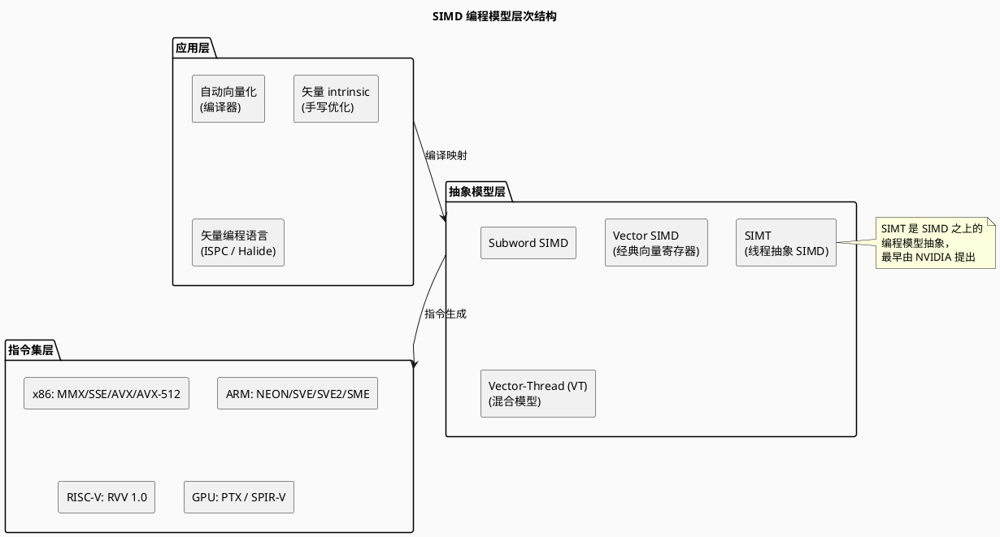
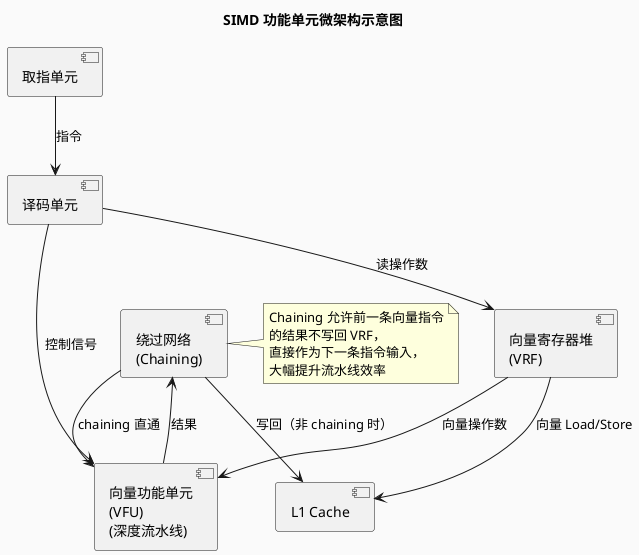
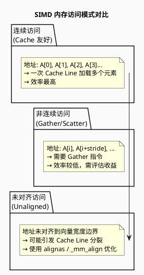

# SIMD 计算范式

> Single Instruction, Multiple Data — 单指令多数据流

---

## 目录

1. [SIMD 核心概念](#simd-核心概念)
2. [SIMD 编程模型分类](#simd-编程模型分类)
3. [主流 SIMD 指令集架构](#主流-simd-指令集架构)
4. [SIMD 微架构实现](#simd-微架构实现)
5. [SIMD 性能优化关键技术](#simd-性能优化关键技术)
6. [PlantUML 架构图示](#plantuml-架构图示)
7. [参考文献](#参考文献)

---

## SIMD 核心概念

### 定义

**SIMD（Single Instruction, Multiple Data）**：一条指令同时操作多个数据元素，是 Flynn 分类法中数据级并行（DLP）的核心实现方式。

```
标量执行（SISD）：
for i in 0..N-1:
    C[i] = A[i] + B[i]
# 需要 N 条加法指令

SIMD 执行：
for i in 0..N-1 step 8:   # 假设 256-bit AVX2，8 个 float32
    C[i..i+7] = A[i..i+7] + B[i..i+7]
# 仅需 N/8 条 vaddps 指令
```

### SIMD 核心优势

| 优势 | 说明 |
|------|------|
| **指令取指带宽节省** | 一条指令完成 N 次运算，减少取指/译码开销 |
| **能耗效率** | 单条 SIMD 指令的能耗 < N 条标量指令 |
| **内存带宽利用** | 连续向量加载/存储最大化 cache line 利用率 |
| **流水线效率** | 向量功能单元可深度流水线化 |

---

## SIMD 编程模型分类

SIMD 并非单一范式，而是包含多个层次的抽象模型：



### 1. Subword SIMD（子字并行）

将通用寄存器的位宽拆分为多个子字同时操作，是最早的 SIMD 实现形式。

- **代表**：Intel MMX（64-bit 寄存器当作 8×8-bit 或 4×16-bit 或 2×32-bit）
- **特点**：复用现有通用寄存器，无需新增寄存器堆
- **局限**：操作数宽度固定，功能受限

### 2. Vector SIMD（经典向量寄存器模型）

引入独立向量寄存器堆，每个向量寄存器可存放多个数据元素。

- **代表**：Cray-1 向量架构、RISC-V RVV
- **特点**：
  - 独立向量寄存器文件（VRF）
  - 深度流水线向量功能单元
  - 支持 Chaining（前一条向量结果直通下一条）
- **向量长度处理**：Strip Mining（循环拆解为适合 VL 的块）

### 3. SIMT（Single Instruction Multiple Threads）

用多线程抽象隐藏 SIMD 硬件细节，是 GPU 的核心编程模型。

- **代表**：NVIDIA CUDA / AMD ROCm
- **特点**：程序员以线程为抽象单元，硬件自动将线程分组为 Warp（SIMD 宽度）执行
- **详见**：[SIMT 范式文档](./02_simt_paradigm.md)

### 4. Vector-Thread (VT) 混合模型

向量与线程的混合抽象，兼具两者优点。

- **代表研究**：UC Berkeley Vector-Thread Architecture
- **特点**：线程可动态决定是向量方式执行还是线程方式执行

---

## 主流 SIMD 指令集架构

### x86 系列

```
MMX  (1996)  →  64-bit，8 个 MM 寄存器
SSE  (1999)  →  128-bit，8 个 XMM 寄存器
SSE2 (2001)  →  128-bit，增加双精度/整数
AVX  (2011)  →  256-bit，16 个 YMM 寄存器，三操作数
AVX2 (2013)  →  256-bit，FMA3，完整整数 SIMD
AVX-512 (2017) → 512-bit，32 个 ZMM 寄存器，8 个掩码寄存器 k0~k7
```

### ARM 系列

```
NEON (ARMv7)  →  128-bit，32 个 Q 寄存器（或 64 个 D 寄存器）
SVE  (ARMv8-A) →  可变宽度 128~2048-bit，与向量长度无关（VLA）
SVE2 (ARMv9)  →  在 SVE 基础上扩展 DSP/计算机视觉/密码学指令
SME  (ARMv9)  →  矩阵扩展，外积矩阵乘法，流式模式
```

### RISC-V 系列

```
RVV 0.7.1  →  早期草案（已废弃，部分芯片实现）
RVV 1.0    →  正式标准（2021 年批准）
  - 32 个向量寄存器 v0~v31
  - vsetvli 指令运行时配置 VL 和 SEW
  - LMUL 支持 1/2/4/8 寄存器组合
  - 7 个掩码寄存器 v0~v7（谓词）
```

---

## SIMD 微架构实现



### Strip Mining 伪代码

当循环迭代次数 N 大于硬件向量长度 VL 时，需进行 Strip Mining：

```c
// 原始循环
for (int i = 0; i < N; i++) {
    C[i] = A[i] + B[i];
}

// 手动 Strip Mining（VL = 8，假设 float32）
int i = 0;
for (; i + 8 <= N; i += 8) {
    // 一条向量指令处理 8 个元素
    v8sf va = *(v8sf*)(A + i);
    v8sf vb = *(v8sf*)(B + i);
    *(v8sf*)(C + i) = va + vb;
}
// 处理尾部余数
for (; i < N; i++) {
    C[i] = A[i] + B[i];
}
```

---

## SIMD 性能优化关键技术

### 1. 对齐与连续访问



### 2. 循环展开（Loop Unrolling）

结合 SIMD 展开可同时利用：
- **数据级并行**（SIMD 宽度）
- **指令级并行**（多执行端口）

```c
// 展开因子 2 + SIMD 宽度 8 = 每次迭代 16 个元素
for (int i = 0; i < N; i += 16) {
    v8sf a0 = load(&A[i]);
    v8sf a1 = load(&A[i+8]);
    v8sf b0 = load(&B[i]);
    v8sf b1 = load(&B[i+8]);
    store(&C[i],   a0 + b0);
    store(&C[i+8], a1 + b1);
}
```

### 3. 分支消除（Branch Elimination）

SIMD 中分支通过**谓词（Predicate）/掩码（Mask）**消除：

```c
// 标量分支（无法向量化）
for (int i = 0; i < N; i++) {
    if (A[i] > 0)
        C[i] = A[i] * B[i];
    else
        C[i] = 0;
}

// SIMD 谓词化（可向量化）
// 对应 AVX-512: vcmpps + vmaskmov
__mmask8 mask = _mm512_cmp_ps_mask(va, vzero, _CMP_GT_OQ);
vc = _mm512_mask_mul_ps(vzero, mask, va, vb);
```

### 4. 归约（Reduction）优化

```c
// 向量归约：先将向量内所有元素部分求和，再标量归约
v8sf sum_vec = _mm256_setzero_ps();
for (int i = 0; i < N; i += 8) {
    v8sf a = _mm256_load_ps(&A[i]);
    sum_vec = _mm256_add_ps(sum_vec, a);
}
// 最后将 sum_vec 的 8 个元素标量归约
float sum = horizontal_add(sum_vec);
```

---

## PlantUML 架构图示

### SIMD 与标量执行对比

```plantuml
@startuml
skinparam backgroundColor #FAFAFA

title 标量 vs SIMD 执行模型对比

package "SISD (标量)" {
  component "取指 #1: ADD" as s1
  component "取指 #2: ADD" as s2
  component "取指 #3: ADD" as s3
  component "取指 #4: ADD" as s4
  s1 -> s2 -> s3 -> s4
}

package "SIMD (向量)" {
  component "取指 #1: VADD (4-way)" as v1
  note right of v1
    一条指令同时完成
    4 个加法操作
  end note
}

@enduml
```

### SIMD 指令流水线

```plantuml
@startuml
skinparam backgroundColor #FAFAFA

title SIMD 向量指令流水线（Chaining 启用）

clock "CLK" as clk

binary "取指" as F
binary "译码" as D
binary "读 VRF" as R
binary "执行 (EX)" as E
binary "写回" as W

F -> D : 指令
D -> R : 操作数地址
R -> E : 向量操作数 (延迟 N 周期)
E -> W : 结果

note over E
  向量功能单元：
  - 深度流水线（N 级）
  - 每个周期可发射一个新向量操作
  - Chaining：结果直通下一条指令
end note

@enduml
```

---

## 参考文献

1. Hennessy, J. L., & Patterson, D. A. (2019). *Computer Architecture: A Quantitative Approach (6th Ed.)*, Chapter 4 (Data-Level Parallelism in Vector, SIMD, and GPU Architectures). Morgan Kaufmann.
2. Intel Corporation. *Intel 64 and IA-32 Architectures Software Developer Manual, Volume 1: Basic Architecture*.
3. ARM Limited. *ARM Architecture Reference Manual - ARMv8, for ARMv8-A architecture profile*.
4. RISC-V International. (2021). *RISC-V "V" Vector Extension Specification, v1.0*.
5. Asanović, K., et al. (2006). *The Landscape of Parallel Computing Research: A View from Berkeley*. UCB/EECS-2006-183.
6. "SIMD & SIMT 与芯片架构", ZOMI 博客园, 2024.
7. "Simplified Vector-Thread Architectures", UC Berkeley EECS Technical Report.
