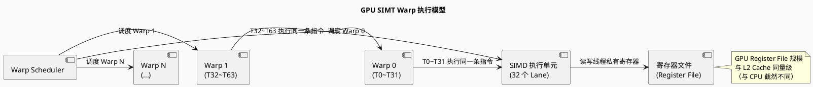
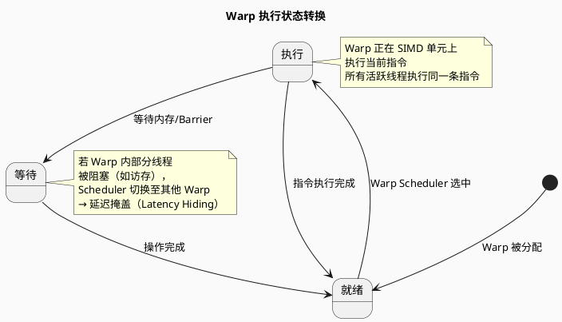
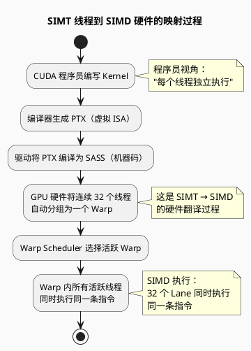
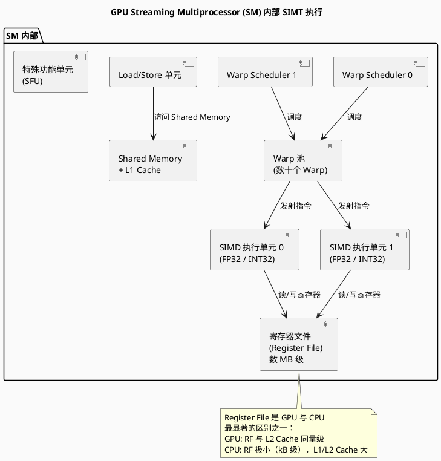

# SIMT 计算范式

> Single Instruction, Multiple Threads — 单指令多线程

---

## 目录

1. [SIMT 核心概念](#simt-核心概念)
2. [SIMT vs SIMD 对比](#simt-vs-simd-对比)
3. [GPU Warp 执行模型](#gpu-warp-执行模型)
4. [SIMT 编程模型（CUDA）](#simt-编程模型cuda)
5. [SIMT 性能优化关键技术](#simt-性能优化关键技术)
6. [PlantUML 架构图示](#plantuml-架构图示)
7. [参考文献](#参考文献)

---

## SIMT 核心概念

### 定义

**SIMT（Single Instruction, Multiple Threads）**：多个线程执行相同的指令流，但各自拥有独立的数据和寄存器状态。由 **NVIDIA** 在 CUDA 编程模型中首次提出。

> **核心洞见**：SIMT 并非新的硬件架构，而是在 SIMD 硬件基础上，通过**线程抽象 + 硬件调度器**，将流水编排的复杂性从程序员转移到硬件。

### SIMT 执行层次

```
Thread（线程）
  └── 最基本的执行单元（逻辑概念）
      └── 拥有独立的寄存器文件、程序计数器

Warp（线程束）
  └── GPU 硬件执行的基本单元（物理概念）
      └── NVIDIA: 32 线程 / 一组
      └── AMD: 64 线程 / 一组（Wavefront）

Thread Block（线程块）
  └── 多个 Warp 的组成的集合
      └── 共享 Shared Memory
      └── 块内同步（__syncthreads）

Grid（网格）
  └── 多个 Thread Block 组成的集合
      └── 对应一次 Kernel 启动
```

---

## SIMT vs SIMD 对比

```plantuml
@startuml
skinparam backgroundColor #FAFAFA

title SIMD vs SIMT 核心差异

package "SIMD（程序员视角）" {
  note
    显式控制向量寄存器
    显式处理掩码/谓词
    显式处理向量长度
    手动 Strip Mining
    手动处理边界余数
  end note
}

package "SIMT（程序员视角）" {
  note
    以线程为抽象单元
    硬件自动分组为 Warp
    硬件自动处理分支发散
    硬件自动调度掩盖延迟
    无需手动向量化
  end note
}

package "底层硬件" {
  component "SIMD 执行单元\n(Warp / Vector Unit)"
}

note bottom of SIMD（程序员视角）
  更高的控制力，
  但编程复杂度极高
end note

note bottom of SIMT（程序员视角）
  更高的可编程性，
  硬件承担复杂调度
end note

SIMD（程序员视角） --> 底层硬件 : 直接映射
SIMT（程序员视角） --> 底层硬件 : 硬件翻译

@enduml
```

### 详细对比表

| 维度 | SIMD（CUDA warp-level 编程） | SIMT（CUDA thread-level 编程） |
|------|---------------------------|----------------------------|
| **编程抽象粒度** | Warp（32 线程一组） | 单线程 |
| **分支处理** | 程序员手动处理 Divergence | 硬件自动处理（re-convergence） |
| **掩码/谓词** | 显式使用 `__activemask()` 等 | 硬件自动管理 |
| **寄存器分配** | 程序员控制 | 编译器 + 硬件分配 |
| **适用场景** | 极致性能优化 | 通用数据并行编程 |
| **代表接口** | PTX `wgmma` 等 Warp 级原语 | CUDA C `/` threadIdx` |

---

## GPU Warp 执行模型

### Warp 基本执行原理



### Warp 执行状态机



### 分支发散（Branch Divergence）处理

```c
// 分支发散示例
__global__ void kernel(int* A, int n) {
    int tid = threadIdx.x + blockIdx.x * blockDim.x;
    if (tid % 2 == 0) {          // ← 分支发散！
        A[tid] = A[tid] * 2;    //   Warp 内一半线程执行
    } else {
        A[tid] = A[tid] + 1;    //   Warp 内另一半线程执行
    }
}
```

**GPU 硬件处理方式**：

```
Warp 内 32 个线程遇到 if-else 分支时：
步骤 1：硬件评估条件，生成 Active Mask
步骤 2：执行 if 分支（仅 Active Mask 中标记为 1 的线程执行）
步骤 3：执行 else 分支（仅 Active Mask 中标记为 0 的线程执行）
→ 总时间 = if 时间 + else 时间（串行化！）

优化：尽量减少 Warp 内分支发散
```

---

## SIMT 编程模型（CUDA）

### CUDA 执行模型映射

```plantuml
@startuml
skinparam backgroundColor #FAFAFA

title CUDA 编程模型 → GPU 硬件映射

package "CUDA 编程概念（软件）" {
  component "Grid\n(Kernel 启动)" as grid
  component "Block 0" as b0
  component "Block 1" as b1
  component "Block N" as bn
  component "Thread (T0...T31)" as t
}

package "GPU 硬件概念（硬件）" {
  component "GPU Device" as gpu
  component "SM 0\n(Streaming Multiprocessor)" as sm0
  component "SM 1" as sm1
  component "SM N" as smn
  component "Warp Scheduler" as ws
  component "SIMD 执行单元" as exec
  component "Warp" as warp
}

grid --> b0, b1, bn : 包含多个 Block
b0 --> t : Block 内包含多个 Thread

gpu --> sm0, sm1, smn : 多个 SM
sm0 --> ws : 每个 SM 有多个 Warp Scheduler
ws --> warp : 调度多个 Warp
warp --> exec : Warp 在 SIMD 单元上执行
t <-[#blue]dashed-> warp : N 个 Thread 被硬件分组的 Warp

note right of t
  CUDA 程序员看到的是
  "每个 Thread 独立执行"
  硬件实际以 Warp 为单位执行
end note

@enduml
```

### CUDA 内存层次与 SIMT

| 内存类型 | 作用范围 | SIMT 意义 |
|---------|---------|----------|
| **Register** | 线程私有 | 每个线程独立寄存器文件，Warp 内 32 线程 = 32 × 寄存器数 |
| **Shared Memory** | Block 内共享 | 同一 Block 内所有线程可访问，用于 Tiling（切块优化） |
| **L1/L2 Cache** | SM 内 / 全局 | 缓存全局内存访问 |
| **Global Memory** | 全局 | 高延迟，需通过 Tiling + Coalescing 优化 |

---

## SIMT 性能优化关键技术

### 1. 访存优化：Tiling（切块）

```
问题：Global Memory 延迟高（数百周期）
解决：将数据先加载到 Shared Memory，再计算

// 未优化：每次计算都访问 Global Memory
for (i = 0; i < N; i++) {
    C[i] = A[i] + B[i];  // 每次都访问 Global Memory
}

// Tiling 优化：先载入 Shared Memory，再计算
__shared__ float As[TILE_SIZE];
As[threadIdx.x] = A[global_idx];  // 载入 Shared Mem
__syncthreads();                    // 等待所有线程载入完成
C[global_idx] = As[threadIdx.x] * 2;
```

### 2. 延迟掩盖：Warp 级并行（Thread-level Parallelism）

```
核心思想：
当 Warp A 因访存被阻塞时，
Warp Scheduler 立即切换至 Warp B 执行
→ 有效掩盖访存延迟

要求：
- 同一 SM 上同时运行大量 Warp（Occupancy 高）
- Register File 足够大，能容纳所有 Warp 的寄存器状态
```

### 3. 内存合并访问（Memory Coalescing）

```
Global Memory 访问模式对比：

连续访问（Coalesced，高效）：
  T0 → A[0], T1 → A[1], T2 → A[2]...
  → 一次 Memory Transaction 满足所有线程

非连续访问（非 Coalesced，低效）：
  T0 → A[0], T1 → A[32], T2 → A[64]...
  → 需要多次 Memory Transaction
```

### 4. 分支发散最小化

```c
// 坏：Warp 内分支发散
if (tid % 32 < 16) { ... }  // 同一个 Warp 内的线程走向不同分支

// 好：Warp 内无分支发散
if (tid / 32 == 0) { ... }  // 同一 Warp 内所有线程走向同一分支
```

---

## PlantUML 架构图示

### SIMT vs SIMD 硬件映射



### GPU SM 内部 SIMT 执行示意



---

## 参考文献

1. NVIDIA Corporation. *CUDA C++ Programming Guide*, Latest Version.
2. Hennessy, J. L., & Patterson, D. A. (2019). *Computer Architecture: A Quantitative Approach (6th Ed.)*, Section 4.4 (GPU Architectures).
3. "深入 SIMT 执行模型：Warp、分支与占用率", 知乎.
4. "SIMD & SIMT 与芯片架构", ZOMI 博客园, 2024.
5. Lindholm, E., et al. (2008). *NV43: An In-Depth Look at NV43*, NVIDIA Technical Brief.
6. "如何快速掌握 GPU 并行计算：llm.c 中 SIMT 架构下的 Warp 调度", CSDN, 2026.
