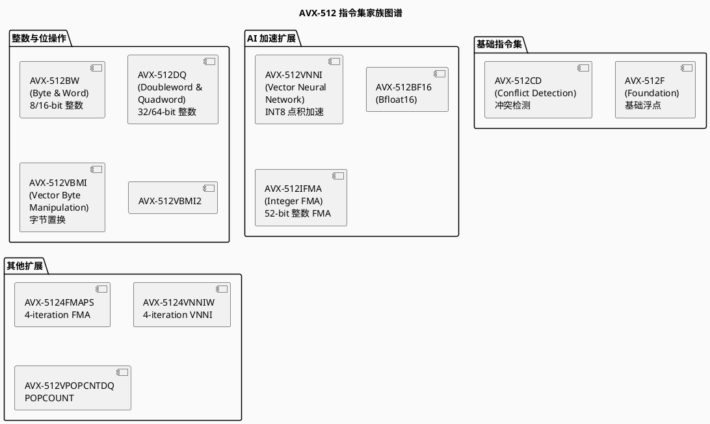
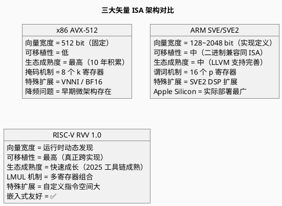

# x86 AVX-512 矢量架构

> Intel Advanced Vector Extensions 512 — 固定宽度矢量 ISA

---

## 目录

1. [概述](#概述)
2. [AVX-512 指令集家族](#avx-512-指令集家族)
3. [微架构实现](#微架构实现)
4. [AVX-512 关键技术细节](#avx-512-关键技术细节)
5. [编程模型与 Intrinsic](#编程模型与-intrinsic)
6. [AVX-512 与其他 ISA 对比](#avx-512-与其他-isa-对比)
7. [PlantUML 架构图示](#plantuml-架构图示)
8. [参考文献](#参考文献)

---

## 概述

**AVX-512** 是 Intel x86 架构的 512 位 SIMD 扩展，首次在 **Intel Xeon Phi（Knights Landing）** 和 **Skylake-SP** 服务器处理器中亮相。

### 核心特性一览

| 特性 | 规格 |
|------|------|
| **向量寄存器宽度** | 512 bit（固定） |
| **向量寄存器数量** | 32 个 ZMM 寄存器（ZMM0 ~ ZMM31） |
| **支持数据类型** | INT8/16/32/64, FP16, FP32, FP64, BF16 |
| **掩码寄存器** | 8 个掩码寄存器（k0 ~ k7） |
| **指令编码** | EVEX 编码格式（4 字节） |
| **新特性** | 嵌入式广播、嵌入式 Rounding、命令合并 |

---

## AVX-512 指令集家族

AVX-512 通过多个**子扩展（Sub-extension）** 逐步扩充功能：



### 各子扩展详解

| 子扩展 | 首次出现 | 核心能力 |
|--------|---------|---------|
| **AVX-512F** | Skylake-SP (2017) | 基础单/双精度浮点，所有 AVX-512 处理器必备 |
| **AVX-512CD** | Knights Landing (2016) | 向量冲突检测（用于 gather/scatter 优化） |
| **AVX-512BW** | Skylake-SP (2017) | 扩展 8-bit / 16-bit 整数向量操作 |
| **AVX-512DQ** | Skylake-SP (2017) | 扩展 32-bit / 64-bit 整数向量操作 |
| **AVX-512VNNI** | Cascade Lake (2019) | INT8 向量点积（4 个 INT8 乘加），深度学习推理加速 |
| **AVX-512BF16** | Cooper Lake (2020) | BF16 格式支持，VNNI 的 BF16 版本 |
| **AVX-512VBMI** | Knights Mill (2017) | 字节级置换操作（密码学、多媒体） |
| **AVX-512VBMI2** | Icelake (2019) | 扩展 VBMI，增加移位/拼接操作 |

---

## 微架构实现

### CPU 微架构对 AVX-512 的支持

```plantuml
@startuml
skinparam backgroundColor #FAFAFA

title Intel 微架构 AVX-512 支持时间线

note
  2016: Knights Landing (Xeon Phi)  — 首款 AVX-512 产品
  2017: Skylake-SP (Xeon)         — 服务器正式支持
  2018: Cannon Lake (Client)        — 仅限量 SKU 支持
  2019: Cascade Lake-SP             — 增加 VNNI
  2020: Cooper Lake                 — 增加 BF16
  2021: Sapphire Rapids            — 增加 AMX（AVX-512 仍支持）
  2023: Emerald Rapids             — 持续演进
  2024: Granite Rapids             — 增加新的 AVX-512 子扩展
end note

@enduml
```



### AVX-512 降频问题（AVX-512 Throttling）

> ⚠️ **重要工程问题**：在部分 Intel 消费级和早期服务器微架构中，执行 AVX-512 指令会导致 CPU 降频 200~400 MHz。

**原因**：512-bit 向量执行单元功耗密度极高，触发电源管理策略的降频保护。

**各代演进**：
- **Skylake-SP**：执行 AVX-512 时降频显著
- **Cascade Lake**：降频改善
- **Sapphire Rapids 及以后**：AMX 矩阵引擎取代 AVX-512 成为 AI 主力，AVX-512 主要用于兼容

---

## AVX-512 关键技术细节

### 1. EVEX 编码格式

EVEX 是 AVX-512 的指令编码格式，相比 AVX 的 VEX 编码：

```
VEX 编码（3 字节）：
  [VEX] OPCODE modrm ...

EVEX 编码（4 字节）：
  [EVEX] OPCODE modrm ...
  新增功能：
  - 支持 32 个向量寄存器（原 16 个）
  - 支持 8 个掩码寄存器（k0~k7）
  - 支持嵌入式 Rounding 模式
  - 支持嵌入式广播（Broadcast）
```

### 2. 掩码寄存器（Mask Registers）

```
k0 ~ k7：每个掩码寄存器有 16/32/64 位（对应 ZMM/YMM/XMM 的对应元素数）

示例（AVX-512）：
  kmovw k1, %eax          ; 将 eax 的低位载入掩码寄存器 k1
  vaddps zmm0{k1}, zmm1, zmm2   ; 仅 k1 中标记为 1 的元素执行加法
```

**掩码 vs 谓词（ARM SVE）**：

| 维度 | AVX-512 掩码 | ARM SVE 谓词 |
|------|-------------|-------------|
| **寄存器** | 8 个独立 k 寄存器 | 16 个 predicate 寄存器（p0~p15） |
| **零屏蔽 vs 合并屏蔽** | 可选择 `{z}` 零屏蔽或合并 | 每个指令可选择 zeroing 或 merging |
| **与向量长度关系** | 固定 8/16/32/64 位 | 与向量长度无关（VLA） |

### 3. 嵌入式广播（Embedded Broadcast）

AVX-512 允许立即数直接广播到所有向量元素：

```c
// 传统方式：先加载到寄存器，再广播
vpbroadcastd zmm0, eax

// EVEX 嵌入式广播：直接在指令中指定
vpaddD zmm0, zmm1, zmm2 {1to16}  // 将 zmm2 的最低元素广播 16 次
```

### 4. 512-bit 宽度与可移植性

```
问题：AVX-512 的 512-bit 宽度在编译时硬编码
→ 若 Intel 未来推出 1024-bit 向量，现有 AVX-512 代码无法自动受益
→ 必须重写 intrinsic 代码或使用不同的编译选项重新编译

对比：
  AVX-512:     编译时固定 512-bit
  ARM SVE:     硬件实现时定义，同一二进制跨实现运行
  RISC-V RVV:  运行时动态发现，同一二进制跨实现运行
```

---

## 编程模型与 Intrinsic

### AVX-512 Intrinsic 命名规则

```
前缀：_mm512_   → 512-bit ZMM 操作
       _mm256_   → 256-bit YMM 操作（AVX）
       _mm_      → 128-bit XMM 操作（SSE）

后缀：
  ps  → packed single precision (float32)
  pd  → packed double precision (float64)
  epi32 → packed integers, 32-bit
  epi16 → packed integers, 16-bit
  mask → 掩码操作
  load / store → 内存操作
  add / sub / mul / fmadd → 算术操作
```

### 代码示例

```c
#include <immintrin.h>

// 向量加法（AVX-512）
void vec_add_avx512(float* a, float* b, float* c, int n) {
    for (int i = 0; i < n; i += 16) {  // 16 个 float32 = 512 bit
        __m512 va = _mm512_loadu_ps(&a[i]);
        __m512 vb = _mm512_loadu_ps(&b[i]);
        __m512 vc = _mm512_add_ps(va, vb);
        _mm512_storeu_ps(&c[i], vc);
    }
}

// 掩码操作示例
void vec_add_masked(float* a, float* b, float* c, __mmask16 mask, int n) {
    for (int i = 0; i < n; i += 16) {
        __m512 va = _mm512_maskz_loadu_ps(mask, &a[i]);
        __m512 vb = _mm512_maskz_loadu_ps(mask, &b[i]);
        __m512 vc = _mm512_maskz_add_ps(mask, va, vb);
        _mm512_mask_storeu_ps(&c[i], mask, vc);
    }
}

// VNNI INT8 点积（推理加速）
void vnni_int8_example(int8_t* a, int8_t* b, int32_t* c) {
    __m512i va = _mm512_loadu_si512(a);
    __m512i vb = _mm512_loadu_si512(b);
    // VNNI: 4 个 INT8 的乘加
    __m512i vc = _mm512_dpbusd_epi32(_mm512_setzero_si512(), va, vb);
    _mm512_storeu_si512(c, vc);
}
```

---

## AVX-512 与其他 ISA 对比



### 综合对比表

| 维度 | AVX-512 | ARM SVE | RISC-V RVV 1.0 |
|------|---------|---------|-----------------|
| **向量宽度模型** | 固定 512-bit | 实现定义 (128~2048) | 运行时动态 (vsetvli) |
| **跨宽度二进制兼容** | ❌ | ✅ | ✅ |
| **跨架构可移植** | ❌（仅 x86） | ❌（仅 ARM） | ✅（任何 RVV 实现） |
| **掩码/谓词** | 8 个 k 寄存器 | 16 个 p 寄存器 | v0 作为掩码寄存器 |
| **LMUL 支持** | ❌ | ❌ | ✅（核心创新） |
| **AI 专用扩展** | VNNI, BF16 | SVE2（间接支持） | 自定义扩展 |
| **生态成熟度** | ⭐⭐⭐⭐⭐ | ⭐⭐⭐⭐ | ⭐⭐⭐ |
| **嵌入式适用** | ❌ | ⚠️（A 系列为主） | ✅ |

---

## PlantUML 架构图示

### AVX-512 寄存器堆结构

```plantuml
@startuml
skinparam backgroundColor #FAFAFA

title AVX-512 寄存器堆结构

package "AVX-512 寄存器" {
  component "ZMM0\n512-bit" as z0
  component "ZMM1\n512-bit" as z1
  component "..." as zz
  component "ZMM31\n512-bit" as z31
}

package "AVX/AVX2 兼容视图" {
  component "YMM0~YMM15\n(ZMM 的低 256-bit)" as ymm
  component "XMM0~XMM15\n(ZMM 的低 128-bit)" as xmm
}

package "掩码寄存器" {
  component "k0" as k0
  component "k1" as k1
  component "..." as kk
  component "k7" as k7
}

note bottom of ZMM0
  32 个 512-bit ZMM 寄存器
  使用 EVEX 编码访问
  与传统 YMM/XMM 兼容
end note

@enduml
```

### AVX-512 与其它矢量扩展的演进关系

```plantuml
@startuml
skinparam backgroundColor #FAFAFA

title x86 SIMD 演进路线

(*) --> MMX : 1996\n64-bit\n4 个 MM 寄存器

MMX --> SSE : 1999\n128-bit\n8 个 XMM 寄存器

SSE --> SSE2 : 2001\n双精度支持\n整数完整支持

SSE2 --> AVX : 2011\n256-bit\n16 个 YMM 寄存器\nVEX 编码

AVX --> AVX2 : 2013\n完整整数 SIMD\nFMA3

AVX2 --> AVX-512 : 2017\n512-bit\n32 个 ZMM 寄存器\nEVEX 编码\n8 个掩码寄存器

AVX-512 --> AMX : 2021 (Sapphire Rapids)\n矩阵加速引擎\nTMUL 单元

note right of AMX
  AVX-512 与 AMX 共存
  AVX-512 用于通用矢量
  AMX 用于矩阵/AI 加速
end note

@enduml
```

---

## 参考文献

1. Intel Corporation. *Intel 64 and IA-32 Architectures Software Developer Manual, Volume 1: Basic Architecture*, Latest Version.
2. Intel Corporation. *Intel Architecture Instruction Set Extensions Programming Reference*, Latest Version.
3. "RISC-V RVV 1.0 vs ARM SVE vs AVX-512 in 2026", MRComputerScience.
4. Hennessy, J. L., & Patterson, D. A. (2019). *Computer Architecture: A Quantitative Approach (6th Ed.)*, Section 4.3.
5. "Migrate SIMD code to the Arm architecture", ARM Learning Paths, 2026.
6. Lemire, D. *SIMD Programming Manual for x86*.
