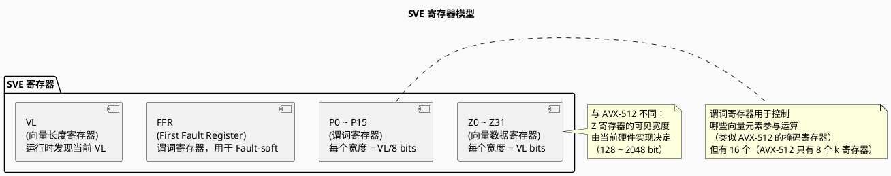
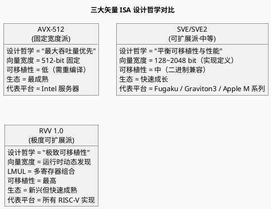
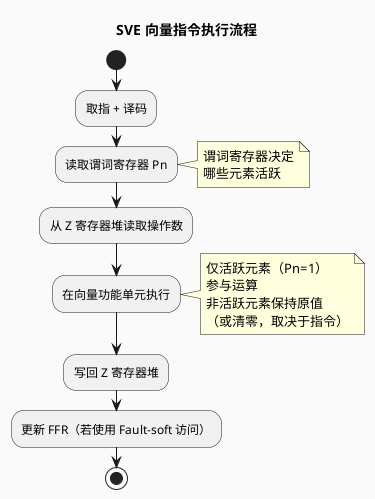
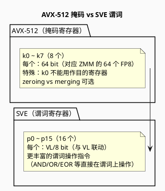
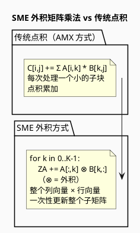

# ARM SVE 与 SME 矢量架构

> Scalable Vector Extension & Scalable Matrix Extension — ARM 可扩展矢量架构

---

## 目录

1. [概述](#概述)
2. [SVE 架构详解](#sve-架构详解)
3. [SVE2 扩展](#sve2-扩展)
4. [SME 架构详解](#sme-架构详解)
5. [SVE/SME 编程模型](#svesme-编程模型)
6. [与 AVX-512/RVV 对比](#与-avx-512rvv-对比)
7. [PlantUML 架构图示](#plantuml-架构图示)
8. [参考文献](#参考文献)

---

## 概述

### ARM 矢量扩展演进路线

```
NEON (ARMv7-A / ARMv8-A)
  └── 128-bit 固定宽度 SIMD
  └── 32 个 Q 寄存器（128-bit）
  └── 应用：移动端 / 早期服务器

SVE (ARMv8-A+)
  └── 可扩展矢量（128 ~ 2048 bit）
  └── 向量长度无关（VLA）编程
  └── 应用：Fugaku 超算 / AWS Graviton3

SVE2 (ARMv9-A)
  └── 在 SVE 基础上扩展 DSP / 信号处理 / 多媒体
  └── 应用：ARMv9 全系列（手机 / 服务器）

SME (ARMv9-A+)
  └── 可扩展矩阵扩展（外积矩阵乘法）
  └── 流式模式（Streaming Mode）
  └── 应用：AI 训练 / 推理加速
```

### 核心设计理念：向量长度无关（VLA）

> SVE/SVE2/SME 的核心突破：**同一份二进制代码，无需重新编译，即可在不同向量宽度的硬件上高效运行**。

```
传统固定宽度 SIMD（AVX-512）：
  编译时固定 512-bit → 新硬件（1024-bit）无法受益

SVE 实现定义宽度：
  硬件实现时确定 VL（如 256-bit）
  软件通过特殊指令发现 VL
  同一二进制在 128/256/512/1024-bit 硬件上均正确运行
```

---

## SVE 架构详解

### 寄存器模型



### 向量长度发现机制

SVE 提供两条关键指令来发现和使用向量长度：

```assembly
// 1. 查询硬件向量长度（以字节为单位）
RDVL X0, #1
// X0 = 当前 VL（字节数），如 VL=256-bit → X0=32

// 2. 以元素数设置向量长度
// 设置 VL 使得可以容纳至少 'count' 个 float64 元素
SETFFR  // 设置 FFR（用于 fault-soft 访问）
```

### SVE 关键指令特性

| 特性 | 说明 |
|------|------|
| **谓词化执行** | 每条向量指令可附带一个谓词寄存器，控制哪些元素执行 |
| **Gather/Scatter** | 原生支持非连续内存访问的向量加载/存储 |
| **归约操作** | 向量内所有元素归约为标量（如 `FADDP`） |
| **向量分区** | 将向量分为多个分区独立操作（`COMPACT`、`SPLICE`） |
| **Fault-soft 访问** | 使用 FFR 寄存器，部分元素访问失败时不影响其他元素 |

### SVE 谓词机制示例

```c
// SVE 谓词化向量加法
#include <arm_sve.h>

void sve_add(float* a, float* b, float* c, int n) {
    int i = 0;
    while (i < n) {
        svbool_t pg = svwhilelt_b32(i, n);  // 生成谓词：前 (n-i) 个元素为 true
        svfloat32_t va = svld1_f32(pg, &a[i]);
        svfloat32_t vb = svld1_f32(pg, &b[i]);
        svfloat32_t vc = svadd_f32_z(pg, va, vb);  // 仅 pg 为 true 的元素执行加法
        svst1_f32(pg, &c[i], vc);
        i += svcntw();  // svcntw() = VL 中 float32 的元素个数
    }
}
```

---

## SVE2 扩展

SVE2 在 SVE 的指令集基础上扩展，面向更广泛的通用计算：

### SVE2 新增能力

| 领域 | 新增指令类型 |
|------|-------------|
| **整数处理** | 字节抽取、字节置换、CRC 加速 |
| **DSP 信号处理** | 复数运算、FFT 蝶形运算、FIR 滤波 |
| **多媒体** | 像素处理、色彩空间转换 |
| **密码学** | AES、SHA（与 NEON 密码学指令协同） |
| **字符串处理** | 向量字符串匹配、比较 |

### SVE2 与 SVE 的关系

```
SVE2 = SVE 的超集
├── 完全继承 SVE 的所有浮点/整数向量指令
├── 新增 DSP/信号处理指令
├── 新增字符串/密码学指令
└── 编程模型完全相同（VLA）
```

---

## SME 架构详解

### SME 核心概念

**SME（Scalable Matrix Extension）**：在 SVE 基础上增加**矩阵运算加速能力**，是 ARM 对标 Intel AMX 和 NVIDIA Tensor Core 的技术。

### 两种计算模式

```plantuml
@startuml
skinparam backgroundColor #FAFAFA

title SME 两种计算模式

package "Normal Mode\n(正常模式)" {
  note
    SVE/SVE2 向量运算
    无矩阵加速
    与 SVE 完全兼容
  end note
}

package "Streaming Mode\n(流式模式)" as sm {
  note
    SME 矩阵运算激活
    外积矩阵乘法（Outer Product）
    矩阵瓦片（Tile）寄存器
    与 Normal Mode 切换有开销
  end note
}

Normal Mode --> sm : SMSTART 指令
sm --> Normal Mode : SMSTOP 指令

@enduml
```

### SME 矩阵瓦片（Tile）寄存器

```
ZA 寄存器（Tile 矩阵寄存器）：
  - 尺寸 = VL × VL（与 SVE 向量长度联动）
  - 例如：VL=256-bit（32 个 FP8 或 16 个 FP16 或 8 个 FP32）
  - ZA 的逻辑形状：[VL/ESIZE] × [VL/ESIZE]

外积矩阵乘法（Outer Product）：
  与 Intel AMX 的点积方式不同，
  SME 使用外积方式：
  
  for i in 0..k-1:
      ZA += A[:, i] ⊗ B[i, :]   // ⊗ = 外积
```

### SME 相比 AMX 的优势

| 维度 | Intel AMX | ARM SME |
|------|-----------|---------|
| **矩阵乘法范式** | 点积（内积） GEMM | 外积（Outer Product） |
| **数据流** | 脉动式（Systolic） | 流式外积累加 |
| **编程灵活性** | 固定 Tile 形状 | 与 VL 联动，更灵活 |
| **生态** | x86 专属 | ARMv9 全平台（包括手机） |

---

## SVE/SME 编程模型

### 向量长度无关（VLA）编程原则

```c
// ❌ 错误：硬编码向量宽度（不可移植）
#define VL 16  // 假设 16 个 float32
for (int i = 0; i < n; i += 16) { ... }

// ✅ 正确：使用 SVE 内建函数发现 VL
#include <arm_sve.h>

void vla_add(float* a, float* b, float* c, int n) {
    int i = 0;
    while (i < n) {
        // svwhilelt_b32: 生成谓词，处理尾部不足一个向量的部分
        svbool_t pg = svwhilelt_b32(i, n);
        svfloat32_t va = svld1_f32(pg, &a[i]);
        svfloat32_t vb = svld1_f32(pg, &b[i]);
        svfloat32_t vc = svadd_f32_z(pg, va, vb);
        svst1_f32(pg, &c[i], vc);
        i += svcntw();  // svcntw() 返回当前 VL 中 float32 元素个数
    }
}
```

### SME 矩阵乘法示例

```c
#include <arm_sve.h>
#include <arm_sme.h>

// SME 外积矩阵乘法示例
void sme_matmul(float* A, float* B, float* C, int M, int N, int K) {
    // 进入 Streaming Mode
    __arm_sme_svstart();

    // 初始化 ZA 瓦片为零
    svzero_za();

    // 外积累加：C += A × B（外积方式）
    for (int k = 0; k < K; k++) {
        svfloat32_t a_col = svld1_f32(svptrue_b32(), &A[k * M]);
        svfloat32_t b_row = svld1_f32(svptrue_b32(), &B[k * N]);
        // 外积：ZA += a_col ⊗ b_row
        svmopa_za32_f32_m(svptrue_b32(), a_col, b_row);
    }

    // 读回 ZA 瓦片到 C
    svwrite_za_f32_to_mem(C);

    // 退出 Streaming Mode
    __arm_sme_svstop();
}
```

---

## 与 AVX-512/RVV 对比



### 详细对比表

| 维度 | AVX-512 | ARM SVE/SVE2 | RISC-V RVV 1.0 |
|------|---------|---------------|-----------------|
| **设计哲学** | 固定宽度，极致吞吐量 | VLA，平衡性能与可移植 | 极致 VLA，跨实现兼容 |
| **向量宽度** | 512 bit（固定） | 128~2048 bit（实现定义） | 运行时通过 `vsetvli` 发现 |
| **谓词/掩码** | 8 个 k 寄存器 | 16 个 p 寄存器 | v0 作为掩码寄存器 |
| **LMUL 支持** | ❌ | ❌ | ✅（核心创新，1~8） |
| **尾部处理** | 掩码或标量余数循环 | 谓词自动处理 | 谓词自动处理 |
| **二进制兼容** | ❌（不同宽度需重编译） | ✅ | ✅ |
| **AI 扩展** | VNNI, BF16 | SVE2（间接支持） | 自定义扩展 |
| **矩阵加速** | AMX（独立扩展） | SME（外积方式） | 无标准矩阵扩展 |

---

## PlantUML 架构图示

### SVE 向量处理流程



### AVX-512 vs SVE 掩码/谓词对比



### SME 外积矩阵乘法原理



---

## 参考文献

1. ARM Limited. *ARM Architecture Reference Manual - ARMv9, for ARMv9-A architecture profile*, Latest Version.
2. ARM Limited. *Scalable Vector Extension (SVE) Programmer's Guide*.
3. ARM Limited. *Scalable Matrix Extension (SME) Programmer's Guide*.
4. "RISC-V RVV 1.0 vs ARM SVE vs AVX-512 in 2026", MRComputerScience.
5. Fujitsu Limited. *A64FX Microarchitecture and SVE Implementation*, Fugaku Technical Report.
6. "Migrate SIMD code to the Arm architecture", ARM Learning Paths, 2026.
7. "RISC-V Vector Extension overview", 0x80.pl Notes, 2024.
8. Hennessy, J. L., & Patterson, D. A. (2019). *Computer Architecture: A Quantitative Approach (6th Ed.)*, Section 4.3.
