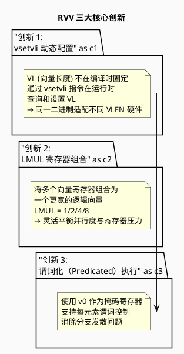
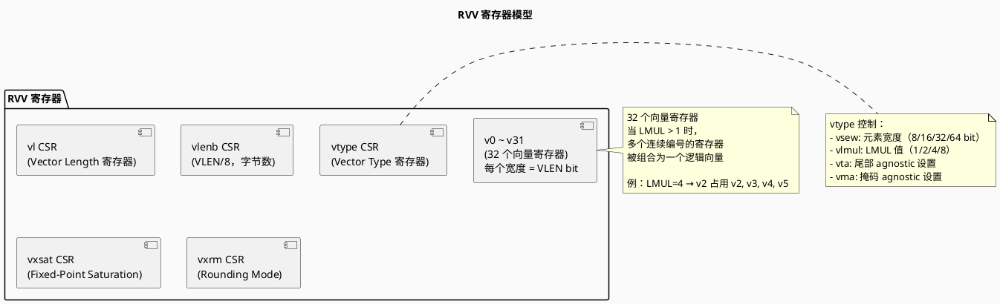
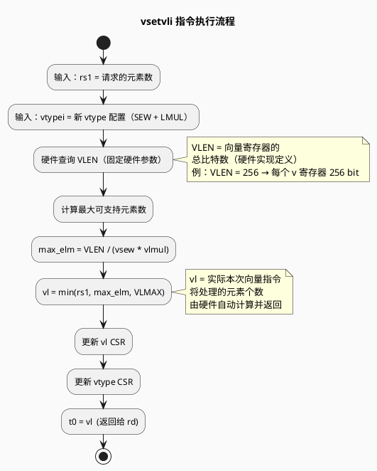
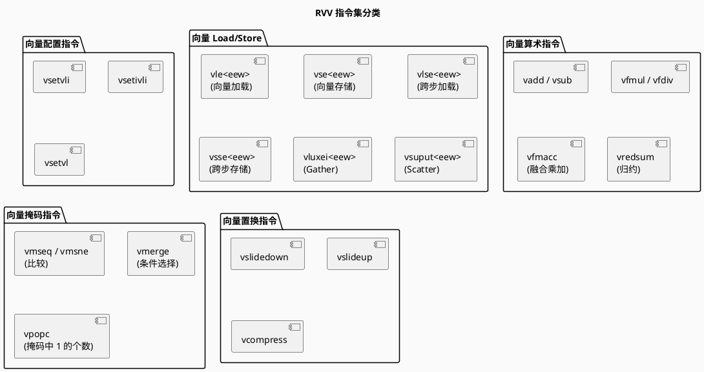
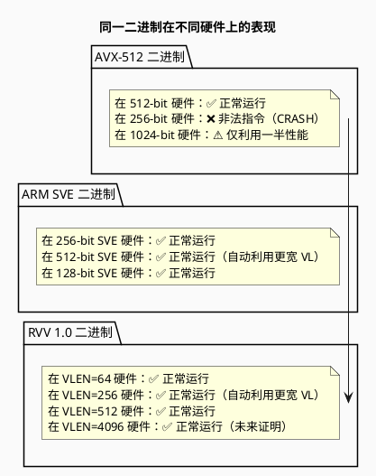
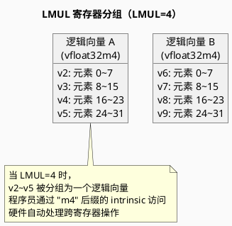

# RISC-V RVV 矢量架构

> RISC-V V Vector Extension 1.0 — 运行时可扩展矢量 ISA

---

## 目录

1. [概述](#概述)
2. [RVV 设计哲学](#rvv-设计哲学)
3. [寄存器模型](#寄存器模型)
4. [vsetvli 指令与动态配置](#vsetvli-指令与动态配置)
5. [LMUL 机制详解](#lmul-机制详解)
6. [RVV 指令分类](#rvv-指令分类)
7. [RVV 与其他 ISA 对比](#rvv-与其他-isa-对比)
8. [编程示例](#编程示例)
9. [PlantUML 架构图示](#plantuml-架构图示)
10. [参考文献](#参考文献)

---

## 概述

**RISC-V RVV（Vector Extension）** 是 RISC-V 指令集架构的可选扩展，最新稳定版本为 **1.0（2021 年批准）**。

### 核心设计目标

| 目标 | 说明 |
|------|------|
| **极致可移植性** | 同一份二进制在所有 RVV 实现上正确运行 |
| **运行时配置** | 向量长度、元素宽度均在运行时确定 |
| **嵌入式友好** | 支持极小向量宽度（64-bit VLEN） |
| **数据中心适用** | 同样支持 512-bit 以上 VLEN |
| **向前兼容** | 未来更宽的向量实现无需修改现有代码 |

> **RVV 的核心宣言**：*"Write Once, Run Everywhere with Vectorization"*

---

## RVV 设计哲学

### 三大创新设计



### RVV vs 传统固定宽度 SIMD

```
传统 SIMD（AVX-512）：
  编译时：512-bit 固定
  新硬件 1024-bit → 必须重编译
  嵌入式 128-bit → 需要不同二进制

RVV：
  编译时：不假定向量宽度
  运行时：vsetvli 查询硬件实际 VLEN
  新硬件 → 同一二进制自动利用更宽向量
  嵌入式 → 同一二进制自动适配更窄向量
```

---

## 寄存器模型

### RVV 寄存器堆



### 关键 CSR 寄存器

| CSR | 全称 | 作用 |
|-----|------|------|
| **vstart** | Vector Start Index | 向量指令起始元素索引（用于分段执行） |
| **vxsat** | Fixed-Point Saturation | 定点饱和标志 |
| **vxrm** | Fixed-Point Rounding Mode | 定点舍入模式 |
| **vtype** | Vector Type | 元素宽度（vsew）+ LMUL + agnostic 设置 |
| **vl** | Vector Length | 当前向量指令处理的元素个数 |
| **vlenb** | VLEN in Bytes | VLEN/8（只读，查询硬件向量宽度） |

---

## vsetvli 指令与动态配置

### vsetvli 指令格式

```assembly
# 完整格式：
vsetvli rd, rs1, vtypei

# 示例：
vsetvli t0, a0, e32, m2, ta, ma
# 含义：
#   t0  = 实际设置的 vl 值（返回）
#   a0  = 请求的向量长度（元素数）
#   e32 = vsew = 32 bit（每个元素 32-bit）
#   m2  = vlmul = 2（2 个寄存器组合）
#   ta  = tail agnostic（尾部不保证值）
#   ma  = mask agnostic（掩码关闭的元素不保证值）
```

### vsetvli 执行流程



### C 语言封装函数

```c
#include <riscv_vector.h>

// 设置向量长度为最多 n 个 float32 元素
unsigned int vl = vsetvli(n, RVV_E32, RVV_M1);

// 实际向量加载（仅前 vl 个元素有效）
vfloat32m1_t va = vle32_v_f32m1(&a[i]);

// 向量加法
vfloat32m1_t vc = vfadd_vv_f32m1(va, vb);

// 写回
vse32_v_f32m1(&c[i], vc);
```

---

## LMUL 机制详解

### LMUL 定义

**LMUL（Vector Register Grouping Multiplier）**：将多个向量寄存器组合为一个逻辑向量。

```
LMUL = 1 → 1 个 v 寄存器 = 1 个逻辑向量
LMUL = 2 → 2 个连续 v 寄存器组合
LMUL = 4 → 4 个连续 v 寄存器组合
LMUL = 8 → 8 个连续 v 寄存器组合
```

### LMUL 与并行度的关系

```plantuml
@startuml
skinparam backgroundColor #FAFAFA

title LMUL 并行度权衡

note "LMUL 越大：\n✅ 逻辑向量越宽 → 每个指令处理更多数据\n❌ 消耗的寄存器越多 → 可同时活跃的向量越多受限" as note1

package "LMUL = 1" {
  note
    v0 独立使用
    v1 独立使用
    ...
    v31 独立使用
    → 最多 32 个独立向量
  end note
}

package "LMUL = 4" {
  note
    v0~v3  组合为一组
    v4~v7  组合为一组
    ...
    → 最多 8 个独立向量组
  end note
}

@enduml
```

### LMUL 选择策略

| 场景 | 推荐 LMUL | 理由 |
|------|----------|------|
| **嵌入式，VLEN 小** | LMUL=1 | 寄存器压力小，最大化独立向量数 |
| **通用计算** | LMUL=2 或 4 | 平衡并行度与寄存器压力 |
| **已知循环次数多** | LMUL=4 或 8 | 最大化每个向量的数据吞吐量 |
| **寄存器压力高** | LMUL=1 | 避免寄存器溢出 |

---

## RVV 指令分类

### 按功能分类



### 向量元素宽度（SEW）与 LMUL 组合规则

| SEW (bit) | LMUL | 每寄存器元素数 | 应用场景 |
|-----------|------|--------------|---------|
| 8 | 1 | VLEN/8 | 图像像素、INT8 推理 |
| 16 | 1 | VLEN/16 | 音频、BF16 |
| 32 | 1 | VLEN/32 | 单精度浮点（主流） |
| 64 | 1 | VLEN/64 | 双精度浮点 |
| 32 | 2 | 2×VLEN/32 | 更宽向量，寄存器消耗 ×2 |

---

## RVV 与其他 ISA 对比

### 可移植性深度对比



### 综合对比表

| 维度 | AVX-512 | ARM SVE | **RISC-V RVV 1.0** |
|------|---------|---------|---------------------|
| **向量宽度** | 固定 512 bit | 实现定义 128~2048 | 运行时动态（vsetvli） |
| **LMUL 支持** | ❌ | ❌ | ✅（核心创新） |
| **跨 VLEN 可移植** | ❌ | ✅ | ✅ |
| **跨架构可移植** | ❌（仅 x86） | ❌（仅 ARM） | ✅（任何 RISC-V 实现） |
| **嵌入式适用** | ❌ | ⚠️ | ✅（VLEN 可极小） |
| **未来证明** | ❌ | ⚠️ | ✅（新 VLEN 自动适配） |
| **工具链成熟度** | ⭐⭐⭐⭐⭐ | ⭐⭐⭐⭐ | ⭐⭐⭐（快速成长中） |

---

## 编程示例

### 示例 1：向量加法（基础）

```c
#include <riscv_vector.h>

void vec_add_rvv(float* a, float* b, float* c, int n) {
    int i = 0;
    while (i < n) {
        // 设置：请求 n-i 个 float32 元素，LMUL=1
        unsigned int vl = vsetvli(n - i, RVV_E32, RVV_M1);
        
        // 向量加载
        vfloat32m1_t va = vle32_v_f32m1(&a[i]);
        vfloat32m1_t vb = vle32_v_f32m1(&b[i]);
        
        // 向量加法
        vfloat32m1_t vc = vfadd_vv_f32m1(va, vb);
        
        // 向量存储
        vse32_v_f32m1(&c[i], vc);
        
        i += vl;  // vl 由硬件返回，实际处理的元素个数
    }
}
// 无需处理尾部余数！vsetvli 自动处理
```

### 示例 2：LMUL=4 更宽向量

```c
// 当循环次数足够多时，可使用 LMUL=4 提升并行度
void vec_add_lmul4(float* a, float* b, float* c, int n) {
    int i = 0;
    while (i < n) {
        // LMUL=4：每个逻辑向量 = 4 个物理寄存器
        unsigned int vl = vsetvli(n - i, RVV_E32, RVV_M4);
        
        vfloat32m4_t va = vle32_v_f32m4(&a[i]);
        vfloat32m4_t vb = vle32_v_f32m4(&b[i]);
        vfloat32m4_t vc = vfadd_vv_f32m4(va, vb);
        vse32_v_f32m4(&c[i], vc);
        
        i += vl;
    }
}
```

### 示例 3：谓词化执行（掩码）

```c
// 条件向量加法：仅对 a[i] > 0 的位置执行 c[i] = a[i] + b[i]
void vec_add_masked(float* a, float* b, float* c, int n) {
    int i = 0;
    while (i < n) {
        unsigned int vl = vsetvli(n - i, RVV_E32, RVV_M1);
        
        vfloat32m1_t va = vle32_v_f32m1(&a[i]);
        vfloat32m1_t vb = vle32_v_f32m1(&b[i]);
        
        // 生成掩码：va > 0 ?
        vbool32_t mask = vmfgt_vf_f32m1_b32(va, 0.0f);
        
        // 谓词化加法：仅 mask=1 的元素执行
        vfloat32m1_t vc = vfadd_vv_f32m1_m(mask, va, vb);
        
        // 掩码存储：仅 mask=1 的元素写回
        vse32_v_f32m1_m(mask, &c[i], vc);
        
        i += vl;
    }
}
```

---

## PlantUML 架构图示

### RVV 运行时配置流程

```plantuml
@startuml
skinparam backgroundColor #FAFAFA

title RVV 向量化循环执行流程

start

:i = 0;

while (i < n?) then (yes)
  :vl = vsetvli(n - i, e32, m1);
  note right
    vl = min(n-i, VLMAX)
    VLMAX = VLEN / (32 × 1)
  end note
  
  :va = load(&a[i], vl);
  :vb = load(&b[i], vl);
  :vc = va + vb;
  :store(&c[i], vc, vl);
  
  :i = i + vl;
else (no)
  stop
endif

@enduml
```

### LMUL 寄存器分组示意



---

## 参考文献

1. RISC-V International. (2021). *RISC-V "V" Vector Extension Specification, Version 1.0*.
2. RISC-V International. *RISC-V Instruction Set Manual, Volume I: Unprivileged ISA*.
3. "RISC-V Vector Extension overview", 0x80.pl Notes, 2024.
4. "RISC-V RVV 1.0 vs ARM SVE vs AVX-512 in 2026", MRComputerScience.
5. LLVM Project. *RISC-V Vector Extension — LLVM 23.0.0git documentation*.
6. SiFive. *RISC-V Vector Extension Programmer's Guide*.
7. "RVV-1.0: RISC-V 布局 AI 的尝试 (一)", 知乎.
8. Asanović, K., et al. *The RISC-V Instruction Set Manual*.
