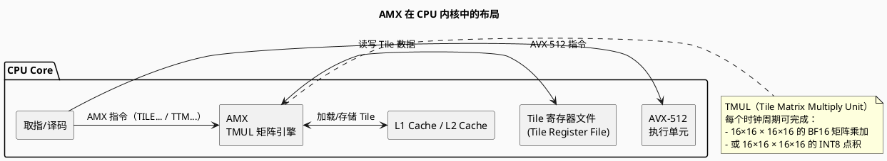
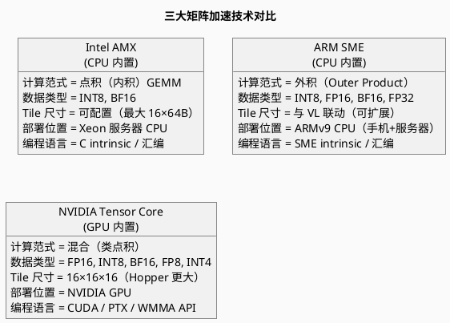
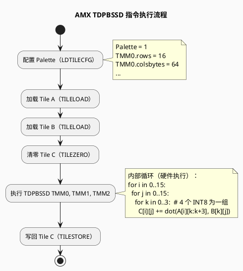
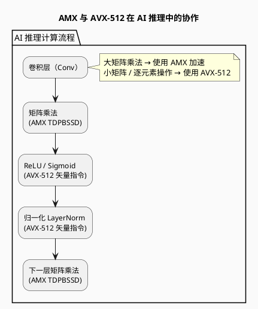

# Intel AMX 矩阵加速架构

> Intel Advanced Matrix Extensions — CPU 内置矩阵乘法引擎

---

## 目录

1. [概述](#概述)
2. [AMX 架构设计](#amx-架构设计)
3. [TMUL 矩阵乘法单元](#tmul-矩阵乘法单元)
4. [Tile 寄存器模型](#tile-寄存器模型)
5. [AMX 指令集](#amx-指令集)
6. [AMX 编程模型](#amx-编程模型)
7. [AMX 与 ARM SME / NVIDIA Tensor Core 对比](#amx-与-arm-sme--nvidia-tensor-core-对比)
8. [PlantUML 架构图示](#plantuml-架构图示)
9. [参考文献](#参考文献)

---

## 概述

**Intel AMX（Advanced Matrix Extensions）** 是 Intel 在第四代 Xeon 可扩展处理器（Sapphire Rapids）中引入的矩阵加速扩展。

### 核心定位

| 维度 | 说明 |
|------|------|
| **本质** | CPU 片上矩阵乘法加速引擎 |
| **目标负载** | 深度学习推理（INT8/BF16）、训练辅助 |
| **与 AVX-512 关系** | 独立扩展，可并存使用 |
| **与 GPU Tensor Core 关系** | CPU 上的类似物，吞吐量更低但延迟更优 |
| **代表微架构** | Sapphire Rapids / Emerald Rapids / Granite Rapids |

### AMX vs AVX-512 分工

```
AVX-512：
  - 通用矢量计算（FP32/FP64/INT 各种宽度）
  - 向量长度 512-bit 固定
  - 适合通用数据并行

AMX：
  - 矩阵乘法专用加速（INT8/BF16）
  - 矩阵 Tile 视图（2D 数据块）
  - 适合 AI 推理/训练中的 GEMM 操作
```

---

## AMX 架构设计

### AMX 在 CPU 内部的布局



### AMX 执行流程

```
步骤 1：配置 Tile（通过 palette 寄存器）
  - 设置 Tile 的行数（rows）和每行字节数（colsbytes）
  - Tile 尺寸因实现而异（Sapphire Rapids: 最大 16×64 byte = 1 KB/Tile）

步骤 2：加载 Tile 数据（TILELOAD）
  - 从内存加载一块 2D 数据到 Tile 寄存器
  
步骤 3：矩阵乘法（TDPBSSD / TDPBF16PS 等）
  - 计算：Tile C += Tile A × Tile B
  - 数据类型取决于具体指令
  
步骤 4：写回 Tile 数据（TILESTORE）
  - 将结果 Tile 写回内存
```

---

## TMUL 矩阵乘法单元

### TMUL 规格（Sapphire Rapids / Emerald Rapids）

| 参数 | 规格 |
|------|------|
| **最大 Tile 数量** | 8 个（TMM0 ~ TMM7） |
| **单个 Tile 最大尺寸** | 16 行 × 64 字节/行（1 KB） |
| **TMUL 吞吐量** | 每个周期 1024 次 INT8 运算（16×16×4） |
| **支持数据类型** | INT8（VNNI 风格）、BF16 |

### TMUL 计算原理

```
TMUL 执行：C += A × B（矩阵乘法）

其中：
  A: [M×K] 矩阵（Tile 格式）
  B: [K×N] 矩阵（Tile 格式）
  C: [M×N] 矩阵（Tile 格式，累加器）

实际尺寸（Sapphire Rapids）：
  A: [16×64] 字节 → 当 BF16 时表示 [16×32] 矩阵
  B: [16×64] 字节 → 当 BF16 时表示 [16×32] 矩阵
  C: [16×64] 字节 → 当 FP32 时表示 [16×16] 矩阵
```

---

## Tile 寄存器模型

### Tile 寄存器文件

```plantuml
@startuml
skinparam backgroundColor #FAFAFA

title AMX Tile 寄存器模型

package "AMX Tile 寄存器" {
  component "TMM0\n[rows×colsbytes]" as t0
  component "TMM1" as t1
  component "..." as t2
  component "TMM7" as t7
}

package "调色板寄存器\n(Palette CSR)" {
  component "palette_id\n(配置方案 ID)" as pal
  component "tile0.rows, tile0.colsbytes" as t0cfg
  component "..." as tcfg
  component "tile7.rows, tile7.colsbytes" as t7cfg
}

note bottom of TMM0
  Tile 的形状由调色板寄存器配置
  （不是固定的！）
  配置后硬件即知道 Tile 的 2D 形状
  用于地址计算和边界检查
end note

@enduml
```

### 调色板（Palette）配置

```
Palette = 0：
  - Tile 未配置（不能执行 TMUL 操作）
  - 需要先配置 Palette = 1

Palette = 1：
  - 配置 8 个 Tile 的(rows, colsbytes)
  - 所有 Tile 共享相同的 rows 值
  - 每个 Tile 可以有独立的 colsbytes 值
```

### 配置示例（C 内联汇编）

```c
// 配置 Palette = 1，Tile 尺寸 = 16 行 × 64 字节/行
asm volatile (
    "ldtilecfg %0"
    :: "m"(tilecfg)
);

// tilecfg 内存布局（64 字节）：
// [0:15]  palette_id (=1)
// [16:31]  start_row (保留)
// [32:47]  reserved
// [48:63]  reserved
// [64:79]  tile0.rows
// [80:95]  tile0.colsbytes
// ... 依次类推 8 个 Tile
```

---

## AMX 指令集

### AMX 指令分类

| 类别 | 指令前缀 | 示例 | 功能 |
|------|---------|------|------|
| **配置** | — | `LDTILECFG` | 加载 Tile 配置 |
| **加载** | `TILELOAD` | `TILELOADDT1` | 从内存加载 Tile |
| **存储** | `TILESTORE` | `TILESTORET1` | 将 Tile 写回内存 |
| **矩阵乘加** | `TDP` | `TDPBSSD` | INT8 矩阵点积累加 |
| **矩阵乘加** | `TDP` | `TDPBF16PS` | BF16 矩阵外积累加 |
| **零初始化** | — | `TILEZERO` | 将 Tile 清零 |

### 关键指令详解

#### `TDPBSSD`（INT8 矩阵乘法）

```
TDPBSSD TMM0, TMM1, TMM2

功能：
  TMM0 += INT8 点积(TMM1, TMM2)
  
数据类型：
  TMM1: INT8 [16×64]（即 [16×64] 个 INT8）
  TMM2: INT8 [16×64]
  TMM0: INT32 [16×16]（累加结果）
```

#### `TDPBF16PS`（BF16 矩阵乘法）

```
TDPBF16PS TMM0, TMM1, TMM2

功能：
  TMM0 += BF16 外积(TMM1, TMM2)
  
数据类型：
  TMM1: BF16 [16×32]（即 [16×32] 个 BF16）
  TMM2: BF16 [16×32]
  TMM0: FP32 [16×16]（累加结果）
```

---

## AMX 编程模型

### 使用 AMX 的典型流程

```c
#include <immintrin.h>

void amx_gemm_int8(int8_t* A, int8_t* B, int32_t* C, int M, int N, int K) {
    // 步骤 1：配置 Tile（假设 M=N=16, K=64）
    _tile_config_t cfg;
    cfg.palette_id = 1;
    for (int i = 0; i < 8; i++) {
        cfg.tile[i].rows = 16;
        cfg.tile[i].cols = 64;
    }
    _tile_load_config(&cfg);
    
    // 步骤 2：清零目标 Tile
    _tile_zero(0);  // TMM0 = 0
    
    // 步骤 3：加载 A 和 B Tile
    _tile_loadd(1, A, K * sizeof(int8_t));  // TMM1 = A
    _tile_loadd(2, B, N * sizeof(int8_t));  // TMM2 = B
    
    // 步骤 4：矩阵乘加
    _tile_dpbssd(0, 1, 2);  // TMM0 += TMM1 × TMM2（INT8）
    
    // 步骤 5：写回结果
    _tile_stored(0, C, N * sizeof(int32_t));
    
    // 步骤 6：释放 Tile 配置
    _tile_release();
}
```

### 与 AVX-512 VNNI 的对比

| 维度 | AVX-512 VNNI | AMX（TDPBSSD） |
|------|----------------|---------------|
| **计算维度** | 向量（1D） | 矩阵（2D） |
| **每条指令** | 16 个 INT8 点积 | 256 个 INT8 点积 |
| **吞吐量** | 较低 | 相同面积下高 4×~8× |
| **适用场景** | 小 batch 推理 | 大矩阵 GEMM |
| **编程复杂度** | 低（类似传统 SIMD） | 高（需管理 Tile 配置） |

---

## AMX 与 ARM SME / NVIDIA Tensor Core 对比



### 综合对比表

| 维度 | Intel AMX | ARM SME | NVIDIA Tensor Core |
|------|-----------|---------|---------------------|
| **首次出现** | Sapphire Rapids (2021) | ARMv9 (2023) | Volta (2017) |
| **计算范式** | 点积 GEMM | 外积累加 | 混合式 GEMM |
| **数据类型** | INT8, BF16 | INT8/16/32, FP16, BF16, FP32 | FP16, INT8, BF16, FP8, INT4 |
| **吞吐（峰值）** | ~1024 INT8/cycle | 取决于 VL | ~2048 FP16/SM/cycle（Hopper） |
| **编程复杂度** | 中（需管理 Tile） | 高（Streaming Mode 切换） | 低（CUDA 自动使用） |
| **主流框架支持** | PyTorch (x86 AMX backend) | PyTorch (ARM SME backend) | PyTorch / TensorFlow 全面支持 |

---

## PlantUML 架构图示

### AMX 矩阵乘加流程



### AMX 与 AVX-512 的协作



---

## 参考文献

1. Intel Corporation. *Intel Architecture Instruction Set Extensions Programming Reference*, Latest Version.
2. Intel Corporation. *Intel Advanced Matrix Extensions (AMX) Overview*, Intel Developer Zone.
3. "Leverage Intel Advanced Matrix Extensions — PyTorch Tutorial", MaskerPRC, 2025.
4. "Intel AMX Overview", Intel CN Official Site, 2026.
5. NVIDIA Corporation. *CUDA C++ Programming Guide — Tensor Core Programming*.
6. ARM Limited. *Scalable Matrix Extension (SME) Programmer's Guide*.
7. Hennessy, J. L., & Patterson, D. A. (2019). *Computer Architecture: A Quantitative Approach (6th Ed.)*, Section 4.5 (Domain-Specific Architectures).
