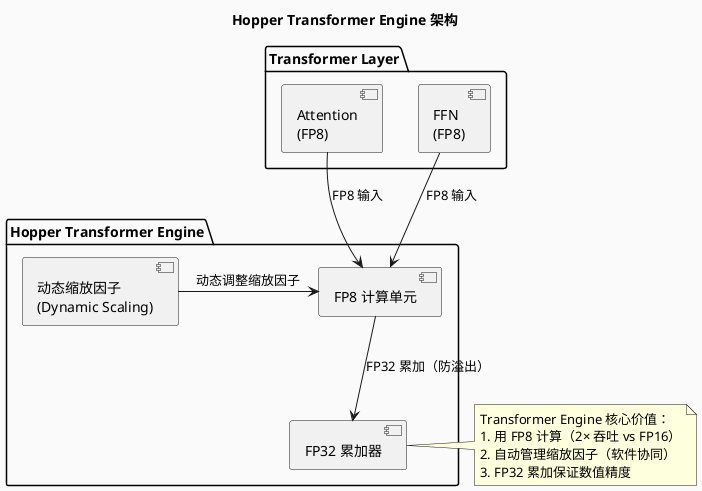
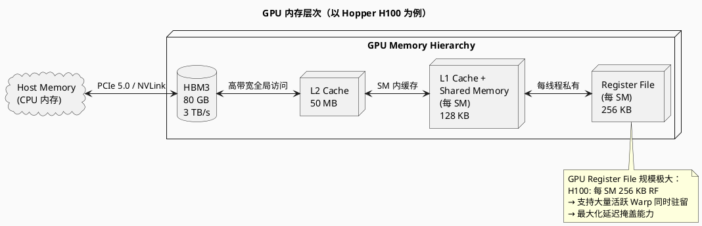
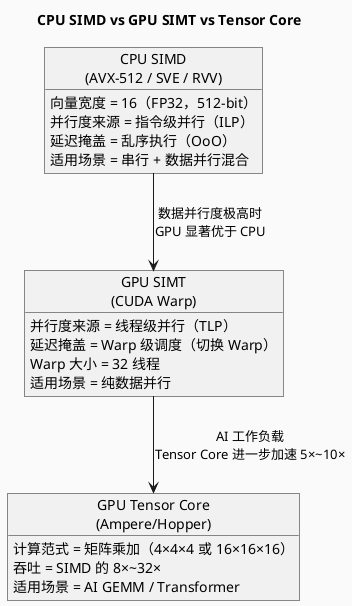
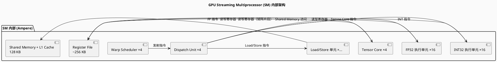

# GPU AI 计算架构

> GPU 矢量计算与 AI 加速架构 — NVIDIA CUDA / Tensor Core

---

## 目录

1. [概述](#概述)
2. [GPU 体系架构演进](#gpu-体系架构演进)
3. [Tensor Core 架构详解](#tensor-core-架构详解)
4. [GPU 内存层次与 AI 计算优化](#gpu-内存层次与-ai-计算优化)
5. [GPU 编程模型（CUDA）与矢量计算](#gpu-编程模型cuda与矢量计算)
6. [多 GPU 与 NVLink](#多-gpu-与-nvlink)
7. [GPU 与 CPU 矢量架构对比](#gpu-与-cpu-矢量架构对比)
8. [PlantUML 架构图示](#plantuml-架构图示)
9. [参考文献](#参考文献)

---

## 概述

GPU 是现代 AI 计算的核心引擎，其架构经历了从**图形专用**到**通用数据并行（GPGPU）**再到**专用 AI 加速（Tensor Core）** 的三次重大演进。

### GPU 计算架构三代对比

| 代 | 代表架构 | 矢量/矩阵能力 | AI 适用性 |
|-----|----------|---------------|----------|
| **第 1 代** | Tesla (2006) | 纯 SIMD，无专用矩阵单元 | 通用并行计算 |
| **第 2 代** | Volta (2017) | 引入 Tensor Core | AI 训练加速 |
| **第 3 代** | Hopper (2022) | Tensor Core + FP8/INT4 支持 | 大模型训练/推理 |

---

## GPU 体系架构演进

```plantuml
@startuml
skinparam backgroundColor #FAFAFA

title NVIDIA GPU 架构演进与 AI 能力

note
  2006: Tesla (G80)      → 首个统一着色器 GPU，CUDA 1.0
  2008: GT200             → 双精度支持
  2010: Fermi (GF100)     → 完整 GPU 计算架构（ECC、L2 Cache）
  2012: Kepler (GK104)    → SMX，大幅提升能效
  2014: Maxwell (GM107)   → SMM，能效进一步优化
  2016: Pascal (GP100)     → HBM 内存，NVLink
  2017: Volta (GV100)     → Tensor Core 首次引入！
  2018: Turing (TU102)    → RT Core + Tensor Core（消费级）
  2020: Ampere (GA100)    → 3rd Gen Tensor Core，支持 TF32/Bfloat16
  2022: Hopper (GH100)    → 4th Gen Tensor Core，FP8 支持，Transformer Engine
  2024: Blackwell (GB100) → 5th Gen Tensor Core，FP4 支持，第二代 Transformer Engine
end note

@enduml
```



---

## Tensor Core 架构详解

### Tensor Core 演进规格

| 架构 | Tensor Core 代 | 支持数据类型 | 矩阵尺寸 | 吞吐（每 SM/周期） |
|--------|---------------|-------------|----------|-------------------|
| Volta | 1st | FP16, FP16×2, INT8 | 4×4×4 | 64 FP16 FMA/cycle |
| Ampere | 3rd | FP16, BF16, TF32, INT8, INT4 | 16×16×16（稀疏） | 256 FP16 FMA/cycle |
| Hopper | 4th | + FP8, INT4, INT1 | 16×16×16 | 512 FP8 FMA/cycle |
| Blackwell | 5th | + FP4 | 16×16×16 | 1024 FP4 FMA/cycle |

### Tensor Core 计算原理

```c
// Volta Tensor Core：WMMA API（Warp-Level Matrix Multiply-Accumulate）
#include <cuda_bf16.h>
#include <mma.h>

using namespace nvcuda;

__global__ void tensor_core_gemm(half* a, half* b, float* c, int M, int N, int K) {
    // 声明片段（Fragments）
    wmma::fragment<wmma::matrix_a, 16, 16, 16, half, wmma::row_major> a_frag;
    wmma::fragment<wmma::matrix_b, 16, 16, 16, half, wmma::col_major> b_frag;
    wmma::fragment<wmma::accumulator, 16, 16, 16, float> c_frag;
    
    // 加载数据到片段
    wmma::load_matrix_sync(a_frag, a, K);
    wmma::load_matrix_sync(b_frag, b, N);
    wmma::load_matrix_sync(c_frag, c, N);
    
    // Tensor Core 矩阵乘加：c_frag += a_frag × b_frag
    wmma::mma_sync(c_frag, a_frag, b_frag, c_frag);
    
    // 写回
    wmma::store_matrix_sync(c, c_frag, N, wmma::mem_row_major);
}
```

### Hopper Transformer Engine



---

## GPU 内存层次与 AI 计算优化

### GPU 内存层次



### AI 工作负载的内存优化策略

| 策略 | 方法 | Tensor Core 关联 |
|------|------|-------------------|
| **Tiling（切块）** | 将矩阵分块载入 Shared Memory | 保证 Tensor Core 数据供给 |
| **Double Buffering** | 计算当前块时预取下一块 | 掩盖 HBM 访问延迟 |
| **Coalescing** | 连续线程访问连续地址 | 最大化 HBM 带宽利用 |
| **Register Blocking** | 用寄存器缓存中间结果 | 减少 Shared Memory 带宽压力 |

---

## GPU 编程模型（CUDA）与矢量计算

### CUDA 线程层次与 SIMT 映射

```
Grid（网格）
  └── Block（线程块）← 对应一个 SM
        └── Warp（线程束，32 线程）← 硬件执行单元
              └── Thread（线程）← 程序员视角的并行单元
```

### CUDA 矢量计算示例（矩阵加法）

```c
__global__ void vec_add_kernel(float* A, float* B, float* C, int N) {
    int idx = blockIdx.x * blockDim.x + threadIdx.x;
    if (idx < N) {
        C[idx] = A[idx] + B[idx];
    }
}
// 编译：nvcc -arch=sm_80 vec_add.cu -o vec_add
// 运行：./vec_add
```

### Tensor Core 编程接口演进

| 接口 | 抽象层次 | 推荐度 |
|------|---------|--------|
| **WMMA API**（Volta+） | Warp 级，需理解 Warp 调度 | ⚠️ 底层 |
| **MMA PTX**（Volta+） | 汇编级，极致控制 | ❌ 不推荐 |
| **cuBLAS / cuDNN** | 库函数，自动使用 Tensor Core | ✅ 推荐 |
| **CUTLASS** | 模板库，自定义内核 | ✅ 推荐 |
| **PyTorch / TensorFlow** | 框架层，自动调度 | ✅✅ 最推荐 |

---

## 多 GPU 与 NVLink

### NVLink 带宽演进

| 代 | GPU | NVLink 单向带宽 | 总双向带宽 |
|----|-----|----------------|-----------|
| NVLink 2.0 | V100 | 25 GB/s / lane | 300 GB/s |
| NVLink 3.0 | A100 | 25 GB/s / lane | 600 GB/s |
| NVLink 4.0 | H100 | 25 GB/s / lane | 900 GB/s |
| NVLink 5.0（?） | B200 | TBD | TBD |

### NVLink 在 AI 训练中的价值

```
问题：大模型参数无法放入单 GPU 显存
解决：
  1. 模型并行（Model Parallelism）→ 跨 GPU 分割模型
  2. 数据并行（Data Parallelism）→ 多 GPU 处理不同 batch
  3. NVLink 高速互联 → GPU 间梯度同步的瓶颈大幅降低
```

---

## GPU 与 CPU 矢量架构对比



### 综合对比表

| 维度 | CPU SIMD (AVX-512) | GPU SIMT (CUDA) | GPU Tensor Core |
|------|-------------------|-------------------|-------------------|
| **向量/矩阵宽度** | 16 FP32 (512-bit) | 32 threads/Warp | 256 FP16/cycle (Ampere) |
| **延迟掩盖** | OoO + 乱序执行 | Warp 调度（数千 Warp） | 同 SIMT |
| **内存带宽** | ~200 GB/s (DDR5) | ~3 TB/s (HBM3) | 同 SIMT |
| **编程复杂度** | 中（intrinsic） | 高（需管理内存层次） | 低（框架自动） |
| **AI 训练适用** | ❌ | ⚠️ 可行但慢 | ✅ 最佳 |
| **推理适用** | ✅（小 batch） | ✅（大 batch） | ✅✅（最高吞吐） |

---

## PlantUML 架构图示

### GPU SM 内部架构



### Tensor Core 矩阵计算流程

```plantuml
@startuml
skinparam backgroundColor #FAFAFA

title Tensor Core GEMM 计算流程

start

:加载 A 矩阵 Tile 到寄存器;
:加载 B 矩阵 Tile 到寄存器;
:加载 C 矩阵 Tile 到累加器;

while (K 维度未完成?) then (yes)
  :Tensor Core 执行: C_tile += A_tile × B_tile;
  note right
    Hopper: 每个时钟 512 次 FP8 FMA
    (即 16×16×16 / 8 个周期)
  end note
  :更新 A_tile, B_tile 指针;
else (no)
  stop
endif

@enduml
```

---

## 参考文献

1. NVIDIA Corporation. *CUDA C++ Programming Guide*, Latest Version.
2. NVIDIA Corporation. *NVIDIA Hopper Architecture In-Depth*, NVIDIA Technical Brief, 2022.
3. NVIDIA Corporation. *NVIDIA Blackwell Architecture Whitepaper*, 2024.
4. Hennessy, J. L., & Patterson, D. A. (2019). *Computer Architecture: A Quantitative Approach (6th Ed.)*, Section 4.4-4.5.
5. "深入 SIMT 执行模型：Warp、分支与占用率", 知乎, 2026.
6. "如何快速掌握 GPU 并行计算：llm.c 中 SIMT 架构下的 Warp 调度", CSDN, 2026.
7. *NVIDIA Ampere Architecture Whitepaper*, NVIDIA, 2020.
8. *NVIDIA Hopper Architecture Whitepaper*, NVIDIA, 2022.
