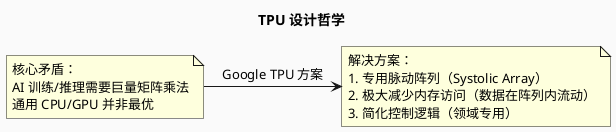
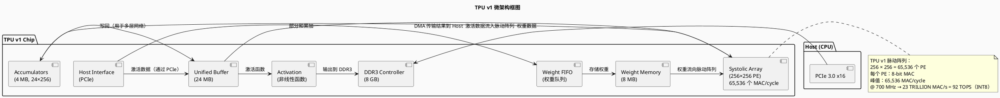
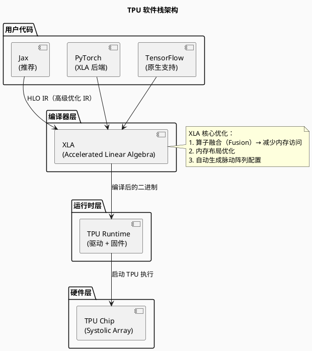
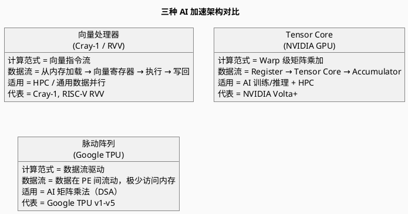
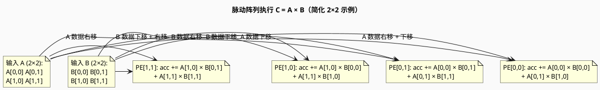
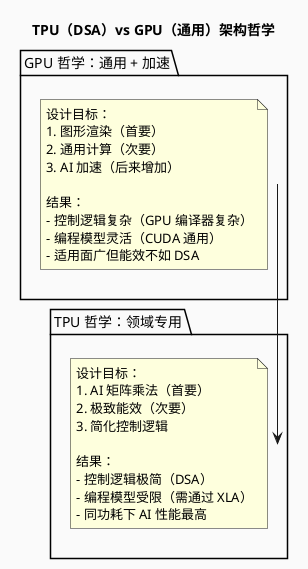

# Google TPU 与脉动阵列架构

> Google Tensor Processing Unit — 脉动阵列驱动的 AI 加速器

---

## 目录

1. [概述](#概述)
2. [脉动阵列（Systolic Array）原理](#脉动阵列systolic-array原理)
3. [TPU v1 ～ v5 架构演进](#tpu-v1--v5-架构演进)
4. [TPU 微架构详解](#tpu-微架构详解)
5. [TPU 编程模型](#tpu-编程模型)
6. [脉动阵列 vs 向量处理器 vs Tensor Core](#脉动阵列-vs-向量处理器-vs-tensor-core)
7. [PlantUML 架构图示](#plantuml-架构图示)
8. [参考文献](#参考文献)

---

## 概述

**TPU（Tensor Processing Unit）** 是 Google 为加速深度神经网络而设计的**专用 ASIC 芯片**，首次发布于 2016 年（TPU v1）。

### TPU 核心设计理念



### TPU vs GPU vs CPU 对比

| 维度 | CPU (AVX-512/AMX) | GPU (Tensor Core) | TPU (Systolic Array) |
|------|-------------------|---------------------|--------------------------|
| **架构类型** | 通用 + 矢量扩展 | 通用 + 图形 + AI 加速 | 领域专用（DSA） |
| **矩阵计算方式** | 向量累加 / Tile 乘加 | Tensor Core 投影乘加 | 脉动阵列（数据流） |
| **能效** | 低 | 中 | **极高** |
| **峰值吞吐** | 低 | 高 | 极高（同功耗下） |
| **编程灵活性** | 高 | 中 | 低（主要为矩阵乘法） |
| **首款产品** | — | 2017 (Volta) | 2016 (TPU v1) |

---

## 脉动阵列（Systolic Array）原理

### 核心概念

**脉动阵列（Systolic Array）**：一种由多个相同处理单元（PE，Processing Element）组成的网状结构，数据在时钟驱动下**像脉搏一样在阵列中流动（Systole = 脉搏）**。

```
传统矩阵乘法（CPU/GPU）：
  从内存读取 A[i,k]，B[k,j]
  计算 A[i,k] × B[k,j]
  写回 C[i,j]
  → 大量内存访问！

脉动阵列（TPU）：
  数据从阵列边界"流入"
  每个 PE 完成部分乘加后，数据"脉动"到相邻 PE
  最终结果在阵列另一端"流出"
  → 数据重用极高，内存访问极少！
```

### 脉动阵列结构

```plantuml
@startuml
skinparam backgroundColor #FAFAFA

title 2D 脉动阵列结构（以 4×4 为例）

node "PE[0,0]" as pe00
node "PE[0,1]" as pe01
node "PE[0,2]" as pe02
node "PE[0,3]" as pe03

node "PE[1,0]" as pe10
node "PE[1,1]" as pe11
node "PE[1,2]" as pe12
node "PE[1,3]" as pe13

node "PE[2,0]" as pe20
node "PE[2,1]" as pe21
node "PE[2,2]" as pe22
node "PE[2,3]" as pe23

node "PE[3,0]" as pe30
node "PE[3,1]" as pe31
node "PE[3,2]" as pe32
node "PE[3,3]" as pe33

pe00 -> pe01 : 右移
pe01 -> pe02 : 右移
pe02 -> pe03 : 右移

pe10 -> pe11 : 右移
pe11 -> pe12 : 右移
pe12 -> pe13 : 右移

pe20 -> pe21 : 右移
pe21 -> pe22 : 右移
pe22 -> pe23 : 右移

pe30 -> pe31 : 右移
pe31 -> pe32 : 右移
pe32 -> pe33 : 右移

pe00 <- pe10 : 下移
pe10 <- pe20 : 下移
pe20 <- pe30 : 下移

@enduml
```



### PE（Processing Element）内部结构

```
每个 PE 包含：
  1. 乘法器（Multiplier）
  2. 加法器（Accumulator）
  3. 输入寄存器（存储 A[i,k]）
  4. 权重寄存器（存储 B[k,j]）
  5. 部分和寄存器（存储 C[i,j] 的部分和）

数据流：
  时钟 1:  A[0,0] 和 B[0,0] 加载到 PE[0,0]
  时钟 2:  A[0,0]→右移，B[0,0]→下移；A[0,1] 和 B[1,0] 加载
  ...
  每个 PE 不断执行：acc += A_in × B_in
```

---

## TPU v1 ～ v5 架构演进


### 各代 TPU 规格对比

| 型号 | 年份 | 峰值 BF16 | 片内 HBM | 主要用途 |
|------|------|-----------|----------|---------|
| **TPU v1** | 2016 | —（仅 INT8） | 8 GB DDR3 | 推理 |
| **TPU v2** | 2017 | 180 TFLOPS | 16 GB HBM | 训练 + 推理 |
| **TPU v3** | 2018 | 420 TFLOPS | 32 GB HBM | 训练 + 推理 |
| **TPU v4** | 2021 | 1.1 PFLOPS | 32 GB HBM | 训练（大规模） |
| **TPU v5e** | 2023 | 197 TFLOPS | 16 GB HBM | 推理（性价比） |
| **TPU v5p** | 2024 | 2.25 PFLOPS | 95 GB HBM | 训练（大规模） |

---

## TPU 微架构详解

### TPU v1 微架构（经典脉动阵列）



### TPU v4/v5 脉动阵列改进

```
改进点（相比 v1）：
  1. 支持 BF16 格式（v2 开始）
  2. 脉动阵列尺寸更大（具体未公开，但更大）
  3. 支持稀疏性加速（Sparsity）
  4. 片内互连拓扑改进（光学互连）
  5. 软件栈成熟（Jax / PyTorch XLA）
```

---

## TPU 编程模型

### TPU 软件栈



### Jax 代码示例

```python
import jax
import jax.numpy as jnp
from jax import random

# 在 TPU 上执行（Jax 自动检测并使用 TPU）
key = random.PRNGKey(0)

# 矩阵乘法（自动使用脉动阵列）
A = random.normal(key, (4096, 4096), dtype=jnp.bfloat16)
B = random.normal(key, (4096, 4096), dtype=jnp.bfloat16)

# Jax 自动通过 XLA 编译为 TPU 脉动阵列指令
C = jnp.dot(A, B)  # ← 在 TPU 脉动阵列上执行

print(C.shape)  # (4096, 4096)
```

---

## 脉动阵列 vs 向量处理器 vs Tensor Core

### 三种 AI 加速架构对比



### 综合对比表

| 维度 | 向量处理器（RVV/SVE） | Tensor Core（GPU） | 脉动阵列（TPU） |
|------|---------------------|---------------------|---------------------|
| **指令集** | 矢量 ISA（vadd.vv 等） | Tensor Core 指令（WMMA） | 无传统 ISA（配置权重 + 激活） |
| **数据复用** | 中（向量寄存器复用） | 高（Register File 大） | **极高**（数据在 PE 间流动） |
| **控制复杂度** | 中 | 高 | **极低**（DSA，控制逻辑少） |
| **能效** | 中 | 高 | **最高** |
| **灵活性** | 高 | 中 | 低（主要为矩阵乘法） |
| **适用领域** | HPC + AI（小模型） | AI（大模型）+ HPC | AI（大模型训练/推理） |

---

## PlantUML 架构图示

### 脉动阵列矩阵乘法原理



### TPU 与 GPU 架构哲学对比



---

## 参考文献

1. Jouppi, N. P., et al. (2017). *In-Datacenter Performance Analysis of a Tensor Processing Unit*. ISCA 2017.
2. Jouppi, N. P., et al. (2023). *Ten Lessons From Three Generations Shaped Google's TPUv4i*. ISCA 2023.
3. Google LLC. *Cloud TPU Architecture Whitepapers*, Latest Versions.
4. "谷歌 AI 的'心脏'长什么样?读懂 TPU 就够了", 腾讯科技, 2026.
5. "谷歌第八代 TPU 双舰齐发", 知乎, 2026.
6. Kung, H. T. (1982). *Why Systolic Architectures?*. IEEE Computer.
7. Hennessy, J. L., & Patterson, D. A. (2019). *Computer Architecture: A Quantitative Approach (6th Ed.)*, Section 4.5 (Domain-Specific Architectures).
8. Google. *Jax Documentation*, https://jax.readthedocs.io/.
