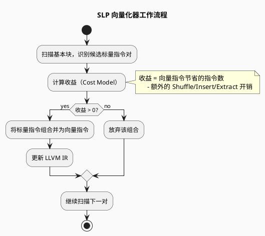
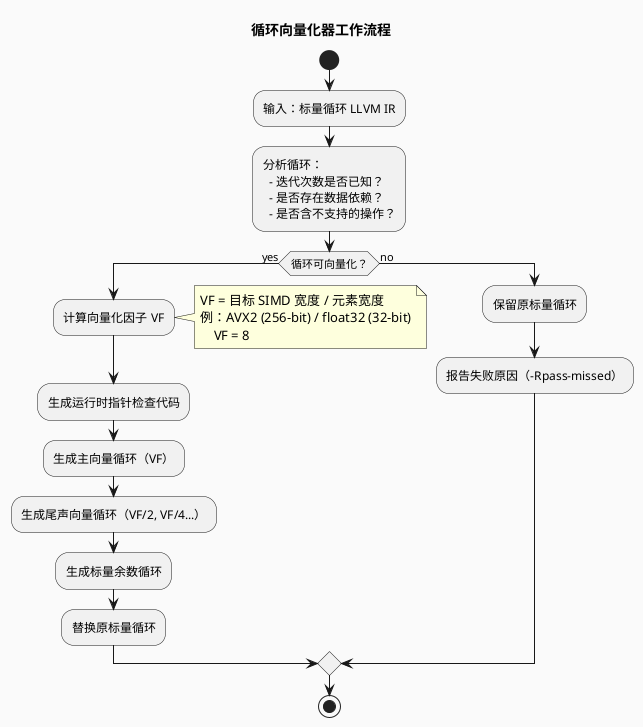

# 自动向量化编程

> 编译器自动向量化技术 — LLVM / GCC 向量化器详解

---

## 目录

1. [概述](#概述)
2. [LLVM 向量化器架构](#llvm-向量化器架构)
3. [循环向量化器（Loop Vectorizer）](#循环向量化器loop-vectorizer)
4. [SLP 向量化器](#slp-向量化器slp-vectorizer)
5. [GCC 自动向量化](#gcc-自动向量化)
6. [向量化诊断与调试](#向量化诊断与调试)
7. [编程指南：写出可向量化的代码](#编程指南写出可向量化的代码)
8. [PlantUML 架构图示](#plantuml-架构图示)
9. [参考文献](#参考文献)

---

## 概述

自动向量化（Auto-Vectorization）是编译器将标量循环自动转换为 SIMD 向量指令的优化技术。

### 两种主要向量化器

| 向量化器 | 作用对象 | 核心策略 | 默认状态 |
|---------|---------|---------|---------|
| **循环向量化器** | 循环结构 | 将多次循环迭代合并为向量指令 | ✅ 默认启用 |
| **SLP 向量化器** | 基本块内标量 | 将独立标量指令合并为向量指令 | ✅ 默认启用 |

> 在 `-O2` / `-O3` 优化级别，两种向量化器均**默认启用**。

---

## LLVM 向量化器架构

```plantuml
@startuml
skinparam backgroundColor #FAFAFA
skinparam componentStyle rectangle

title LLVM 自动向量化编译流程

package "源代码\n(.c / .cpp)" {
}

package "LLVM 前端\n(Clang)" {
  component "词法/语法分析"
  component "生成 LLVM IR\n(标量)" as ir
}

package "LLVM 优化流水线" {
  component "循环向量化器\n(Loop Vectorizer)" as lv
  component "SLP 向量化器\n(SLP Vectorizer)" as sv
  component "其他优化 Pass" as opt
}

package "后端代码生成" {
  component "指令选择\n(SelectionDAG)" as sel
  component "寄存器分配" as ra
  component "机器码生成" as cg
}

源代码 --> "词法/语法分析"
"词法/语法分析" --> ir
ir --> lv : 标量 LLVM IR
ir --> sv : 标量 LLVM IR
lv --> sel : 向量化 LLVM IR
sv --> sel : 向量化 LLVM IR
sel --> ra --> cg

note right of lv
  处理循环：
  - Strip Mining
  - 运行时指针检查
  - 归约/归纳变量识别
  - 尾声向量化
end note

note right of sv
  处理基本块：
  - 搜索可合并的标量组
  - 自底向上分析
  - 适合结构体操作
end note

@enduml
```

---

## 循环向量化器（Loop Vectorizer）

### 启用与控制

```bash
# 禁用循环向量化
clang -fno-vectorize file.c

# 强制指定向量化因子（Vectorization Factor）
clang -mllvm -force-vector-width=8 file.c

# 强制指定展开因子（Interleave Factor）
clang -mllvm -force-vector-interleave=2 file.c
```

### Pragma 指令（源码级控制）

```c
// 显式启用向量化与交错
#pragma clang loop vectorize(enable) interleave(enable)
for (int i = 0; i < n; i++) {
    A[i] = B[i] + C[i];
}

// 指定向量宽度与交错计数
#pragma clang loop vectorize_width(8) interleave_count(2)
for (int i = 0; i < n; i++) {
    A[i] = B[i] * 2.0f;
}
```

---

### 支持的向量化特性

#### ① 循环次数未知的循环

```c
// 循环边界在运行时确定 → 循环向量化器仍可处理
void bar(float *A, float *B, float K, int start, int end) {
    for (int i = start; i < end; ++i)
        A[i] *= B[i] + K;
}
// 编译器自动插入：
//   1. 运行时计算迭代次数
//   2. 主向量循环
//   3. 尾部标量余数循环
```

#### ② 指针运行时检查（别名检测）

```c
void bar(float *A, float *B, float K, int n) {
    for (int i = 0; i < n; ++i)
        A[i] *= B[i] + K;
}
// 若 A 和 B 可能重叠（别名）：
//   编译器自动插入运行时指针范围检查
//   若重叠 → 回退到标量版本
//   若不重叠 → 执行向量版本
```

#### ③ 归约（Reductions）

```c
int foo(int *A, int n) {
    unsigned sum = 0;
    for (int i = 0; i < n; ++i)
        sum += A[i] + 5;
    return sum;
}
// sum 被识别为归约变量
// 向量化：先将向量内多个元素部分求和
//         最后将向量寄存器内元素标量归约
//
// 注意：浮点归约需 -ffast-math（因浮点加法不满足结合律）
```

#### ④ 归纳变量（Inductions）

```c
void bar(float *A, int n) {
    for (int i = 0; i < n; ++i)
        A[i] = i;   // i 为归纳变量
}
// 归纳变量也可向量化：
//   vector_i = [i, i+1, i+2, i+3, ...]
//   vstore(&A[i], vector_i)
```

#### ⑤ If 转换（If-Conversion）

```c
for (int i = 0; i < n; ++i) {
    if (A[i] > B[i])
        sum += A[i] + 5;
}
// 控制流被"展平"为谓词化执行：
//   mask = vcmpgt(A, B)
//   vsum = vadd_masked(vsum, vA + vB, mask)
```

#### ⑥ 分散/收集（Scatter/Gather）

```c
A[i] += B[i * 4];  // 非连续访问
// 需要 Gather 指令加载 B[i*4], B[(i+1)*4], ...
// 成本模型通常认为收益低，需 -force-vector-width 强制
```

---

### 优化策略

#### 策略一：尾声向量化（Epilogue Vectorization）

```
问题：循环次数不是向量宽度的整数倍时，
      尾部需要标量执行，效率低。

解决：用更小的向量化因子向量化尾部循环

典型控制流：
[运行时检查：A 和 B 是否重叠？]
    │
    ▼
[主向量循环：VF = 8]
    │
    ▼
[尾声向量循环：VF = 4]  ← 新！
    │
    ▼
[标量余数循环：VF = 1]
```

#### 策略二：部分展开（Partial Unrolling）

```c
// 原始循环
for (int i = 0; i < n; ++i)
    sum += A[i];

// 展开后（展开因子 2）：
//   - 每个迭代处理 2 个元素
//   - 可同时使用 2 个执行端口（提升 ILP）
//   - 决策：由成本模型综合评估寄存器压力和代码大小
```

---

## SLP 向量化器（SLP Vectorizer）

### 核心原理

将**基本块内结构相似的独立标量指令**合并为向量指令。

```c
// 原始标量代码
void foo(int a1, int a2, int b1, int b2, int *A) {
    A[0] = a1 * (a1 + b1);   // ─┐
    A[1] = a2 * (a2 + b2);   // ─┘ → 合并为一条向量乘法
    A[2] = a1 * (a1 + b1);   // ─┐
    A[3] = a2 * (a2 + b2);   // ─┘ → 再次合并
}
```

### SLP 向量化器工作流程



---

## GCC 自动向量化

GCC 同样支持自动向量化，使用 `-ftree-vectorize` 启用（在 `-O3` 默认启用）。

### GCC 向量化相关标志

```bash
# 启用向量化（O3 默认启用）
gcc -O3 file.c

# 显式启用
gcc -O2 -ftree-vectorize file.c

# 禁用向量化
gcc -fno-tree-vectorize file.c

# 生成向量化报告
gcc -O3 -fopt-info-vec file.c

# 详细向量化报告
gcc -O3 -fopt-info-vec-all file.c
```

### GCC 与 LLVM 向量化能力对比

| 特性 | LLVM (Clang) | GCC |
|------|--------------|-----|
| **循环向量化** | ✅ 成熟 | ✅ 成熟 |
| **SLP 向量化** | ✅ 成熟 | ✅ 成熟 |
| **Epilogue 向量化** | ✅ 支持 | ✅ 支持 |
| **AvX-512 支持** | ✅ 良好 | ✅ 良好 |
| **ARM SVE 支持** | ✅ 良好 | ✅ 良好 |
| **RVV 支持** | ✅ 良好（LLVM 17+） | ⚠️ 部分支持 |
| **诊断信息** | `-Rpass` 体系 | `-fopt-info` 体系 |

---

## 向量化诊断与调试

### LLVM / Clang 诊断选项

```bash
# 标识成功向量化的循环
clang -O3 -Rpass=loop-vectorize file.c

# 标识失败的循环及原因
clang -O3 -Rpass-missed=loop-vectorize file.c

# 标识导致失败的具体语句
clang -O3 -Rpass-analysis=loop-vectorize file.c

# 生成优化记录文件（可配合 LLVM opt-viewer）
clang -O3 -fsave-optimization-record file.c
# 生成：file.opt.yaml

# 确保精确的行号/列号
clang -O3 -gline-tables-only -gcolumn-info file.c
```

### 向量化失败的常见原因

| 失败原因 | 示例 | 解决方案 |
|---------|------|---------|
| **含 switch 语句** | `switch(x) { case 1: ... }` | 改用 if-else 链 |
| **函数调用无法向量化** | 调用未知函数 | 内联函数或使用向量化版本 |
| **复杂控制流** | 多重嵌套分支 | 简化控制流 |
| **数据依赖** | 跨迭代写后读依赖 | 确认无依赖后使用 `restrict` |
| **非连续访问** | `A[i*4]` | 重构数据布局或使用 Gather |
| **类型转换开销大** | `int*` 转 `float*` | 评估收益或使用强制向量化 |

---

## 编程指南：写出可向量化的代码

### ✅ 好的实践

```c
// 1. 简单循环结构
for (int i = 0; i < n; i++) {  // ✅ 简单边界
    C[i] = A[i] + B[i];
}

// 2. 使用 restrict 关键字（消除别名不确定性）
void foo(float* restrict A, float* restrict B, int n) {
    for (int i = 0; i < n; i++)
        A[i] += B[i];
}

// 3. 连续内存访问
for (int i = 0; i < n; i++) {  // ✅ 连续
    C[i] = A[i] * 2;
}

// 4. 避免循环内分支（或让分支简单）
for (int i = 0; i < n; i++) {
    C[i] = (A[i] > 0) ? A[i] : 0;  // ✅ 简单三元表达式
}
```

### ❌ 避免的实践

```c
// 1. 复杂控制流
for (int i = 0; i < n; i++) {
    switch(A[i]) {  // ❌ 无法向量化
        case 1: ...; break;
    }
}

// 2. 指针别名不确定
void foo(float* A, float* B, int n) {
    for (int i = 0; i < n; i++)
        A[i] += B[i];  // ❌ 编译器不知道 A 和 B 是否重叠
}

// 3. 非连续访问
for (int i = 0; i < n; i++) {
    C[i] = A[i*2] + B[i*2];  // ⚠️ 需要 Gather，成本模型可能拒绝
}

// 4. 循环边界不恒定
int start = ...;
int end = ...;
for (int i = start; i < end; i++) {  // ⚠️ 仍可向量化，但有运行时开销
    ...
}
```

---

## PlantUML 架构图示

### 循环向量化器工作流程



### 向量化收益模型

```plantuml
@startuml
skinparam backgroundColor #FAFAFA

title 向量化收益评估模型

object "成本模型输入" as input {
  循环迭代次数
  向量化因子 VF
  展开因子 UF
  指令延迟
  功能单元吞吐率
  寄存器压力
  内存访问模式
}

object "收益计算" as calc {
  向量指令数 vs 标量指令数
  掩码/谓词开销
  Shuffle 指令开销
  内存带宽利用率
}

object "决策" as decision {
  收益 > 阈值 → 执行向量化
  收益 ≤ 阈值 → 保留标量
}

input --> calc --> decision

@enduml
```

---

## 参考文献

1. LLVM Project. *Auto-Vectorization in LLVM — LLVM Documentation*, Latest Version.
2. GCC Team. *GCC Vectorizer — GCC Documentation*, Latest Version.
3. Lemire, D. *SIMD Programming Manual for x86 and ARM*.
4. "Auto-Vectorization in LLVM", 简书/腾讯云, 2020.
5. "LLVM 中的自动向量化", LLVM 中文文档, 2025.
6. Hennessy, J. L., & Patterson, D. A. (2019). *Computer Architecture: A Quantitative Approach (6th Ed.)*, Section 4.3.4.
7. Nuzman, D., & Zaks, A. (2006). *Autovectorization in GCC — Two Years Later*. GCC Summit.
